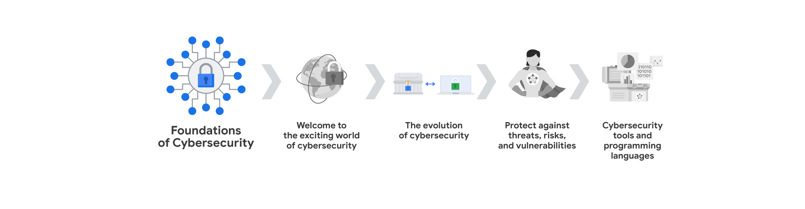
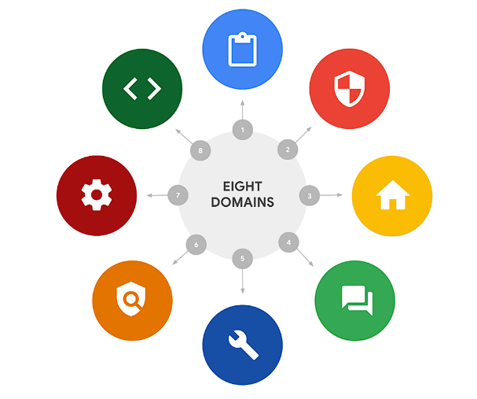
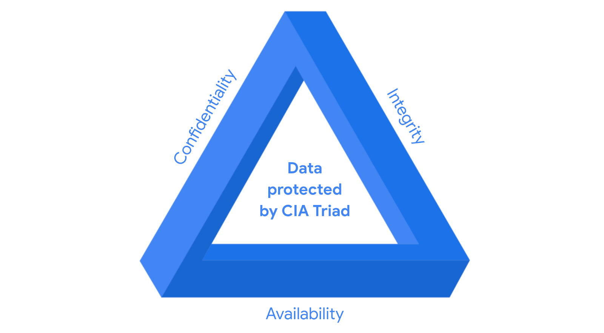

# Módulo 1: Bienvenido al apasionante mundo de la ciberseguridad

## Introduccion a la ciberseguridad
- **Ciberseguridad**: Es la proteccion de la informacion y los sistemas de computadoras de ataques no autorizados. La ciberseguridad consta de 3 pilares fundamentales:
      - **confidencialidad**: La informacion solo debe ser accesible para las personas autorizadas.
      - **integridad**: La informacion debe ser precisa y confiable.
      - **disponibilidad de la informacion**: La informacion debe estar disponible para las personas autorizadas cuando la necesiten.

### Tipos de amenasas
- **Internas**: Las amenasas son aquellas que provienen por parte de los ex-empleados que trabajaron en la empresa o por parte de los empleados actuales que trabajan en la empresa o socios e incluso hasta un proveedor de servicios. Puede ser intencional (robo de datos) o accidental (hacer clic en un enlace malicioso).
- **Externas**: Las amenasas son aquellas que provienen de personas ajenas a la empresa como los hackers, crackers, ciberdelincuentes, piratas informaticos, que buscan aprovecharse de las vulnerabilidades para obtener beneficios propios.

### Beneficios de la ciberseguridad
- **Proteccion de la informacion**: La ciberseguridad protege la informacion de los usuarios y de las empresas.
- **Proteccion de los sistemas**: La ciberseguridad protege los sistemas de computadoras de las empresas.
- **Mantenimiento de la confianza**: La ciberseguridad mantiene la confianza de los usuarios y de las empresas.

### Roles en ciberseguridad
- **Analista de seguridad**Enfocado en la proteccion de sistemas y datos de una organizacion. Esto incluye tareas como el analisis de riesgos y la implementacion de medidas de seguridad y la respuesta a incidentes de seguridad.
- **Analista de ciberseguridad**: Cumple funciones similares al de un analista de seguridad, pero con un enfoque mas especifico al las amenasas ciberneticas. Esto puede incluir el analisis de malware, la seguridad de la red.
- **Centro de operaciones de seguridad (SOC)**: Este equipo se encarga de motitorear y responde a las amenazas de seguridad en tiempo real.
- **Analista de seguridad de la informacion**: enfocado en la informacion confidencial de la organizacion. Esto incluye la implememntacion de politicas de seguridad, implementacion de controles de acceso.

### Preguntas y Respuestas

1. Pregunta 1: ¿Cuál es la diferencia entre una amenaza interna y una amenaza externa en ciberseguridad?
2. Pregunta 2: ¿Cuáles son los tres principios fundamentales de la seguridad de la información, a menudo conocidos como la tríada CIA?
3. Pregunta 3: Imagina que eres un analista de seguridad y observas un aumento repentino en el tráfico de red proveniente de una fuente desconocida. ¿Qué medidas tomarías para investigar y mitigar esta posible amenaza?
       - Respuesta
         - Identificar la fuente del tráfico: Analizar las direcciones IP, puertos y protocolos utilizados para determinar el origen del tráfico sospechoso.
         - Analizar el comportamiento del tráfico: Investigar si el tráfico coincide con patrones conocidos de ataques, como escaneo de puertos o intentos de acceso no autorizados.
         - Aislar el tráfico sospechoso: Si se confirma que el tráfico es malicioso, se deben tomar medidas para aislarlo de la red, como bloquear las direcciones IP o puertos de origen.
         - Investigar la causa raíz: Una vez contenido el ataque, es importante investigar cómo se originó la amenaza para prevenir futuros incidentes.
         - Documentar y reportar: Registrar todos los hallazgos y acciones tomadas para futuras referencias y para informar al equipo de seguridad y a la gerencia.
         - Dar aviso al SOC: Si el incidente es grave o requiere una respuesta inmediata, se debe notificar al Centro de Operaciones de Seguridad (SOC) para una intervención más especializada.
4. ¿Por qué es importante para una empresa mantener actualizados sus sistemas operativos y software?
    - Mantener los sistemas operativos y el software actualizados es crucial para la seguridad de una empresa porque las actualizaciones suelen incluir parches de seguridad que corrigen vulnerabilidades conocidas.
    - Al no actualizar, las empresas se exponen a un mayor riesgo de ataques cibernéticos, ya que los atacantes buscan activamente explotar estas vulnerabilidades.

### Terminología común sobre ciberseguridad

- Cumplimiento Normativo: Se refiere al cumplimiento de las leyes y regulaciones relacionadas con la seguridad de la información. Permitiedole a las organizaciones evitar sanciones y multas por incumplimiento.
- Marcos de Seguridad: Son marcos de trabajo que proporcionan un conjunto de controles y mejores prácticas para proteger la información y los sistemas de una organización.
- Controles de Seguridad: Son medidas y procedimientos que se implementan para proteger los activos de una organización y mitigar los riesgos de seguridad.
- Postura de Seguridad: Es la capacidad que tiene una organizacion para gestionar su defensa de activos y datos criticos.
- Agente de Amenaza o Atacante Malicioso: Es una persona o grupo que representa un riesgo para la seguridad de una organizacion al intentar comprometer sus sistemas y datos.
- Amenaza Interna: Es una amenaza que proviene por parte de un ex-exempleado o empleado actual de la empresa, estas amenazas pueden darse ya sea de manera intencional o accidental.
- Seguridad de la Red: Es mantener la infraestructura de red de una organizacion de accesos no autorizados y ataques maliciosos.
- Seguridad de la nube: Es proteger los datos y aplicaciones almacenados en la nube, asegurando que solo las personas autorizadas tengan acceso a ellos. La nube es un subcampo de la ciberseguridad que se enfoca en proteger los recursos de computación en la nube de los ataques cibernéticos.
- La programacion: Es el proceso de escribir instrucciones para que una computadora realice una tarea específica o repetitiva. Como ser la automatizacion de tareas repetitivas en ciberseguridad, revicion de trafico de red, alerta de actividades sospechosas.

### Competencias basicas para los profecionales de la ciberseguridad:
- **Habilidades Transferibles**: Son habilidades de otras areas que se aplican a diferentes carreras, como la resolucion de problemas, la comunicacion, la colaboracion, getion del tiempo, mentalidad de crecimiento y diversidad de perspectivas.
  - **Comunicacion**: Saber comprender los problemas y saber comunicarlos de manera clara y concisa de manera de que tanto las personas que tengan conocimientos tecnico y aquellos que no lo tengan puedan entenderlo.
  - **Resolucion de Problemas**: Saber identificar los problemas y encontrar soluciones efectivas, ademas de ser capaz de adaptarse a situaciones cambiantes. Puede hacerlo reconociendo patrones para luego determinar una solucion efectiva.
  - **Colaboracion**: Saber trabajar en equipo y ser capaz de colaborar con otros profesionales para lograr un objetivo comun.
  - **Gestion del tiempo**: Saber administrar el tiempo de manera eficiente y priorizar las tareas segun su importancia y urgencia.
  - **Mentalidad de crecimiento**: Estar dispuesto a aprender y a mejorar constantemente, ademas de ser capaz de adaptarse a los cambios y desafios.
  - **Diversidad de perspectivas**: Ser capaz de ver las cosas desde diferentes puntos de vista y apreciar la diversidad de opiniones y experiencias, fomentando la inclusion, la equidad y el respeto por los demas.
- **Habilidades tecnicas**: tambien pueden ser aplicables a barias areas pero sin embargo a veces se pueden requerir el conocimiento de ciertas herramientas como ser: Herramientas de administracion de eventos e informacion de seguridad (SIEM), Sistemas de deteccion de intrusiones (IDS), Sistemas de prevencion de intrusiones (IPS), Conocimiento sobre el panorama de las amenazas, Respuestas ante incidentes, lenguajes de programacion.
  - **Herramientas de administracion de eventos e informacion de seguridad (SIEM)**: Son herramientas que permiten a los profesionales de la ciberseguridad monitorear y analizar los eventos de seguridad en tiempo real, lo que les permite detectar las posibles amenazas, riesgos, vulnerabilidades de la seguridad con mayor eficacia.
  - **Sistemas de deteccion de intrusiones (IDS)**: Son sistemas que monitorean y analizan el tráfico de red en busca de actividades sospechosas o maliciosas, como intentos de acceso no autorizados o ataques de denegación de servicio.
  - **Sistemas de prevencion de intrusiones (IPS)**: Son sistemas que detectan y bloquean automáticamente las amenazas de seguridad en tiempo real, protegiendo los sistemas y datos de una organización contra ataques cibernéticos.
  - **Conocimiento sobre el panorama de las amenazas**: Es importante que los profesionales de la ciberseguridad estén al tanto de las últimas tendencias y amenazas en el campo de la ciberseguridad, para poder anticipar y mitigar posibles riesgos de seguridad ante nuevas variantes de malware, ataques de phishing, ransomware entre otros.
  - **Respuestas ante incidentes**: Los profesionales de la ciberseguridad deben estar preparados para responder rápidamente a los incidentes de seguridad, investigar las causas raíz y tomar medidas correctivas para minimizar el impacto de los ataques cibernéticos.
### CompTIA Seguridad+
- **CompTIA Security+**: Es una certificacion de seguridad de la informacion que valida las habilidades y conocimientos de los profesionales de la ciberseguridad en areas como la identificacion de amenazas, la implementacion de controles de seguridad y la respuesta a incidentes de seguridad.
### Términos y definiciones del Curso 1, Módulo 1
- **Ciberseguridad (o seguridad)**: La práctica de garantizar la confidencialidad, integridad y disponibilidad de la información protegiendo las redes, los dispositivos, las personas y los datos del acceso no autorizado o de la explotación delictiva
- **Seguridad de la nube**: El proceso de garantizar que los recursos almacenados en la Nube están configurados correctamente y que el acceso a dichos recursos está limitado a los usuarios autorizados
- **amenaza interna**: Un empleado actual o anterior, un proveedor externo o un socio de confianza que supone un riesgo para la Seguridad.
- **Amenaza externa**: Un atacante malicioso que no tiene relación con la organización y que intenta explotar las vulnerabilidades de la organización para obtener beneficios personales.
- **Seguridad de la red**: La práctica de mantener la infraestructura de red de una organización a salvo de accesos no autorizados.
- **Informacion de identificacion personal (PII)**: Cualquier Información utilizada para inferir la identidad de un individuo como ser: Nombre, Direccion, Numero de telefono, Numero de seguro social, Fecha de nacimiento.
- **Informacion de identificacion personal sensible (SPII)**: Un tipo específico de PII que entra dentro de las directrices de manejo más estrictas. Información de identificación personal que puede ser utilizada para cometer fraude o robo de identidad como ser: Informacion financiera, Informacion medica, Informacion de tarjetas de credito.
- **Postura de seguridad**: La capacidad de una organización para gestionar su defensa de activos y datos críticos y reaccionar ante los cambios
- **Habilidades Tecnicas**: Habilidades que requieren el conocimiento de herramientas, Procedimientos y políticas específicas para realizar tareas específicas.
- **Habilidades Transferibles**: Habilidades que se pueden aplicar a diferentes carreras y campos.
- **Amenaza**: Cualquier circunstancia o evento que puede impactar negativamente en los recursos de una organización.
- **Agente de amenaza**: Cualquier persona o grupo que presente un riesgo para la seguridad de una organización.
- **Marco de seguridad**: Un conjunto de controles y mejores prácticas que se utilizan para proteger la información y los sistemas de una organización.
- **Controles de seguridad**: Medidas y procedimientos que se implementan para proteger los activos de una organización y mitigar los riesgos de seguridad.
- **Cumplimiento normativo**: El cumplimiento de las leyes y regulaciones relacionadas con la seguridad de la información.

# Módulo 2: La evolución de la ciberseguridad

En este modulo analizaremos la evolucion de la ciberseguridad, enfatizando el como los incidentes de la decada de los 80 y 90 llevaron a la creacion de la ciberseguridad como una disciplina y la importancia de la ciberseguridad en la actualidad.
En esta seccion cubriremos los siguientes temas: virus, malware, ingenieria social y la evolucion de las amenasas en la era digital.

## Ataques de ciberseguridad pasados

Esta area esta en contante evolucion, ahora poder ver el panorama completo de los ataques es decir ver el pasado podria ayudara mejorar la deguridad en el futuro, debido a que muchos de los ataaques realizados a dia de hoy no son completamente nuevos, a menudo solo son variantes de ataques anteriores.

## Terminos clavesÑ
- **Virus**: Es un codigo malisioso diseñado interferir con las operaciones de una computadora y causar daño a los datos y al software, tiene la capacidad de infectar otros archivos y programas para luego expandirse a otras computadoras por medio de la red. Un ejemplo de los primeros ataques son: [el virus Brain y el gusano Morris](https://recluit.com/virus-brain-y-gusano-morris-los-primeros-malware-de-la-historia/).
  - [**Virus Brain**](https://keepcoding.io/blog/que-hace-el-virus-brain/): Fue el primer virus informatico que se conoce, fue creado en 1986 por dos hermanos pakistanies, el virus Brain se propago a traves de disquetes y mostraba un mensaje de advertencia a los usuarios. Si bien se propagaba a través de disquetes, su impacto principal era más bien disruptivo. Ralentizaba el sistema y mostraba mensajes, pero no estaba diseñado para destruir datos o causar daños graves.
  - [**Gusano Morris**](https://keepcoding.io/blog/que-es-el-gusano-morris/): Fue uno de los primeros gusanos informaticos que se conoce, fue creado en 1988 por Robert Tappan Morris, desarrollo un programa para evaluar el tamaño de internet, pero el programa tenia un error que causo que se propagara a traves de la red infectando miles de computadoras. A comparacion con el virus Brain el gusano Morris tenía un efecto mucho más destructivo. Al replicarse sin control, saturaba la memoria de los equipos infectados, provocando que dejaran de funcionar correctamente. Imagina que miles de personas intentan entrar a la vez por una puerta; el resultado es un bloqueo total.
  
  - CERTs: Despues de los ataques anteriores se establecieron equipos de respuesta a emergencias informaticas (CERTs) para ayudar a las organizaciones a responder a los incidentes de seguridad y mitigar los riesgos de seguridad. 

## Ataques en la era digital:

- Con la expancion de los dispositivos conectados a internet, los ataques ciberneticos se han vuelto mas sofisticados y peligrosos debido a que ya no se necesitan disquetes para propagar los virus, ahora se pueden propagar a traves de la red, lo que hace que sea mas facil para los atacantes infectar a un gran numero de dispositivos en poco tiempo. Algunos de los ataques mas comunes en la actualidad son: el ataque **LoveLetter** y la brecha de seguridad de **Equifax**.
  - [**Ataque LoveLetter**](https://es.wikipedia.org/wiki/ILOVEYOU): El malware LoveLetter se propagó principalmente a través de correos electrónicos. Se enviaba a las direcciones de correo electrónico encontradas en el libro de direcciones de la víctima, haciéndose pasar por un correo electrónico de un amigo con el asunto "Te amo" y un archivo adjunto llamado "Carta de amor para ti". Una vez que el usuario abría el archivo adjunto, el malware se ejecutaba y comenzaba a recopilar información como: 
    - **Credenciales de inicio de sesión de Internet**: El malware estaba diseñado para robar nombres de usuario y contraseñas almacenados en el ordenador de la víctima. 
    - **Libro de direcciones**: El malware escaneaba el libro de direcciones de la víctima para propagarse a más contactos.
    **_La ingeniería social es una técnica de manipulación que explota el error humano para obtener información privada, acceso u objetos de valor_**
  - [**Brecha de seguridad de Equifax**](https://es.wikipedia.org/wiki/Equifax): fue un ataque cibernetico que expuso la informacion personal de millones de usuarios. En 2017, Equifax, una de las agencias de informes crediticios más grandes del mundo, sufrió una brecha de seguridad que expuso la información personal y financiera de millones de personas. Los atacantes explotaron una vulnerabilidad en el software de Equifax para acceder a la base de datos de la empresa y robar información confidencial, como números de seguro social, fechas de nacimiento y direcciones. La brecha de seguridad de Equifax fue uno de los mayores incidentes de seguridad de la información en la historia y tuvo un impacto significativo en la confianza del público en la empresa y en la seguridad de los datos personales.

## Ataques comunes y su eficacia

**Tipos de Ataques:**

* **Phishing:** Engaño a través de comunicaciones digitales para obtener información confidencial o implementar software malicioso.
    * **Subtipos:** 
        * **Compromiso de correo electrónico empresarial (BEC):** Suplantación de identidad para engañar a los empleados y realizar transferencias de dinero.
        * **Spear phishing:** Ataque malicioso por correo electrónico dirigido a un usuario o grupo de usuarios específico. El correo electrónico parece proceder de una fuente de confianza.
        * **Whaling:** Una forma de phishing dirigido. Agentes de amenaza tienen como objetivo a ejecutivos de la empresa para obtener acceso a datos confidenciales.
        * **Vishing:** El exploit de la comunicación electrónica de voz para obtener información sensible o hacerse pasar por una fuente conocida.
        * **Smishing:** El uso de mensajes de texto para engañar a los usuarios, con el fin de obtener información sensible o hacerse pasar por una fuente conocida.

* **Malware (Software malicioso):** Software diseñado para dañar dispositivos o redes.
    * **Subtipos:**
        * **Virus:** Programa que se replica y se propaga a través de la infección de otros programas.
        * **Worms:** Software malicioso que puede duplicarse y propagarse por los sistemas por sí mismo. A diferencia de un virus, un gusano no necesita ser descargado por un usuario. En su lugar, se autorreplica y se propaga desde una computadora ya infectada a otros dispositivos de la misma red.
        * **Ransomware:** Ataque malicioso en el que los agentes de amenazas encriptan los Datos de una organización y exigen un pago para restablecer la accesibilidad.
        * **Spyware:** Software malicioso que se utiliza para recopilar y vender Información sin consentimiento. El software espía puede utilizarse para acceder a los dispositivos. Esto permite a los agentes de amenaza recopilar datos personales, como correos electrónicos privados, textos, grabaciones de voz e imágenes y ubicaciones.

* **Ingeniería Social:** Manipulación que explota el error humano para obtener información, acceso o bienes.
    * **Subtipos:**
        * **Phishing en redes sociales:** Un agente de amenaza recopila información detallada sobre su objetivo en los sitios de redes sociales. A continuación, inician un ataque.
        * **Ataque de "agujero de agua":**  Un agente de amenaza ataca un sitio web visitado con frecuencia por un grupo específico de usuarios.
        * **USB baiting:** Un agente de amenaza deja estratégicamente una memoria USB con software malicioso para que un empleado la encuentre e instale, con el fin de infectar una red sin saberlo.
        * **Ingeniería social física:** Un agente de amenaza se hace pasar por un empleado, cliente o proveedor para obtener acceso no autorizado a un lugar físico.

**Principios de la Ingeniería Social:** La ingenieria social es increiblemente eficaz, Esto se debe a que la gente se confia demasiado y esta condicionada a respetar la autoridad.

* **Autoridad:** Agentes de amenaza se hacen pasar por personas con poder. Esto se debe a que la gente, en general, ha sido condicionada a respetar y seguir a las figuras de autoridad.
* **Intimidación:**  Los Agentes de amenaza utilizan tácticas de intimidación. Esto incluye persuadir e intimidar a las víctimas para que hagan lo que se les dice.
* **Consenso/Prueba Social:** Explotación de la confianza en la acción colectiva.
* **Escasez:** Táctica utilizada para dar a entender que la oferta de bienes o servicios es limitada.
* **Familiaridad:** Agentes de amenaza establecen una falsa conexión emocional con los usuarios que puede ser explotada.
* **Confianza:** Los agentes de amenaza establecen una relación emocional con los usuarios que puede ser explotada a lo largo del tiempo. Utilizan esta relación para desarrollar la confianza y obtener información personal.
* **Urgencia:** Un agente de amenaza persuade a los demás para que respondan rápidamente y sin hacer preguntas.

## Los ocho dominios de Seguridad CISSP: 

Tener un conocimiento solido de los conceptos basicos de la ciberseguridad es fundamental para cualquier profesional de la ciberseguridad. El modelo de seguridad CISSP es un marco de trabajo que se utiliza para organizar y clasificar los conceptos de la ciberseguridad en ocho dominios principales. Estos dominios son:

1. **Seguridad y gestion de riesgos**: Se trata de identificar, evaluar y gestionar los riesgos de seguridad para proteger los activos de una organización. Es como ser el arquitecto de la seguridad, diseñando estrategias para prevenir y mitigar posibles amenazas. 
2. **Seguridad de los recursos**: Aquí nos enfocamos en proteger la información y los datos, ya sea en formato físico o digital. Imagina que eres el guardián de la información, asegurando su confidencialidad, integridad y disponibilidad. 
3. **Arquitectura e ingenieria de seguridad**: Este dominio se centra en el diseño, la implementación y la gestión de controles de seguridad en sistemas y aplicaciones. Es como ser el ingeniero de seguridad, construyendo y fortificando las defensas de la organización.
4. **Seguridad de la red y las comunicaciones**: Se centra en la protección de las redes y las comunicaciones, asegurando que la información viaje segura y sin interrupciones. Piensa en ti como el protector de las autopistas de la información, garantizando un flujo seguro y confiable.
5. **Administracion de identidades y accesos**: Se centra en controlar quién tiene acceso a qué información y recursos. Es como ser el portero de la organización, verificando la identidad y autorizando el acceso solo a las personas adecuadas.
6. **Evaluacion y pruebas de seguridad**: Aquí se trata de evaluar la eficacia de los controles de seguridad y buscar vulnerabilidades. Imagina que eres el detective de la seguridad, investigando y poniendo a prueba las defensas para identificar puntos débiles.
7. **Operaciones de seguridad**: Este dominio se encarga de la gestión y el mantenimiento diario de los controles de seguridad. Es como ser el oficial de operaciones, asegurándose de que todo funcione correctamente y respondiendo a cualquier incidente.
8. **seguridad de desarrollo de software**:  Aquí nos enfocamos en integrar la seguridad en el ciclo de vida del desarrollo de software. Piensa en ti como el asesor de seguridad para los desarrolladores, guiándolos para crear software seguro desde el principio.

## Tipos de ataque:

* **Ataque de descifrado de contraseña**: Es el intento de acceder por contraseña a dispositivos, sistemas, redes, o datos protegidos. Entre su calsificacion encontramos:
    * **Fuerza bruta**: Es un ataque que intenta descifrar una contraseña probando todas las combinaciones posibles de caracteres hasta encontrar la correcta.
    * **Tabla Rainbow**: Es un archivo que contiene las contraseñas y sus correspondientes hash. Los atacantes pueden utilizar tablas arcoiris para descifrar contraseñas de forma más rápida.
  
      Este tipo de ataque se encuentra dentro del dominio de **Comunicacion y la seguridad de redes**.

* **Ataque de ingeniería social**: Es una tecnica de manipulacion que busca engañar a las personas para que revelen información confidencial o realicen acciones que no deberian hacer. Entre su clasificacion encontramos:
    * **Phishing**: Es un tipo de ataque de ingeniería social en el que los atacantes envían correos electrónicos fraudulentos que parecen provenir de una fuente confiable para engañar a las personas y obtener información confidencial.
    * **Vishing**: Es un tipo de ataque de ingeniería social que utiliza la comunicación de voz para engañar a las personas y obtener información confidencial.
    * **Smishing**: Es un tipo de ataque de ingeniería social que utiliza mensajes de texto para engañar a las personas y obtener información confidencial.
    * **Ataque de "agujero de agua"**: Es un tipo de ataque de ingeniería social en el que los atacantes atacan un sitio web visitado con frecuencia por un grupo específico de usuarios.
    * **Ingeniería social física**: Es un tipo de ataque de ingeniería social en el que los atacantes se hacen pasar por empleados, clientes o proveedores para obtener acceso no autorizado a un lugar físico.
    * **USB baiting**: Es un tipo de ataque de ingeniería social en el que los atacantes dejan una memoria USB con software malicioso para que un empleado la encuentre e instale, con el fin de infectar una red sin saberlo.
    * **Phishing en redes sociales**: Es un tipo de ataque de ingeniería social en el que los atacantes recopilan información detallada sobre su objetivo en los sitios de redes sociales y luego inician un ataque.
    * **Phishing dirigido (spear phishing)**: Es un tipo de ataque de ingeniería social en el que los atacantes envían correos electrónicos maliciosos dirigidos a un usuario o grupo de usuarios específico.

      Este tipo de ataque se encuentra dentro del dominio de **Seguridad y gestión de riesgos**.
* **Ataque físico**: Un insidente de seguridad que no solo afecta a los entornos digitales, sino tambien a los fisicos. Entre su clasificacion tenemos:
    * **Cable USB malicioso**: Es un tipo de ataque físico en el que los atacantes dejan un cable USB con software malicioso para que un empleado lo encuentre e instale, con el fin de infectar una red sin saberlo.
    * **Unidad Flash maliciosa**: Es un tipo de ataque físico en el que los atacantes dejan una unidad flash con software malicioso para que un empleado la encuentre e instale, con el fin de infectar una red sin saberlo.
    * **Clonacion y robo de tarjetas**: Es un tipo de ataque físico en el que los atacantes clonan o roban tarjetas de crédito o débito para obtener información financiera confidencial.

      Este tipo de ataque se encuentra dentro del dominio de **Seguridad de los recursos**.
* **Inteligencia artificial antagónica**: Es una tecnica que manipula la inteligencia artificial y la tecnologia de aprendizaje automatico para engañar a los sistemas de seguridad y realizar ataques maliciosos. Entre su clasificacion encontramos:
    * **Ataque adversario**: Es un tipo de ataque de inteligencia artificial antagónica en el que los atacantes manipulan los datos de entrada de un sistema de aprendizaje automático para engañarlo y realizar acciones maliciosas.
    * **Ataque de envenenamiento de datos**: Es un tipo de ataque de inteligencia artificial antagónica en el que los atacantes manipulan los datos de entrenamiento de un sistema de aprendizaje automático para engañarlo y realizar acciones maliciosas.

      Este tipo de ataque se encuentra dentro del dominio de **Seguridad de la red y las comunicaciones**. 
* **Ataque a la cadena de suministro**: Ataque criptográfico que afecta a formas seguras de Comunicación entre un remitente y un destinatario. Algunas formas de ataques criptográficos son:
    
* **Ataque criptográfico**:
    * **Cumpleaños**: Es un tipo de ataque criptográfico que explota la paradoja del cumpleaños para encontrar colisiones en funciones hash.
    * **Colision**: Es un tipo de ataque criptográfico que busca encontrar dos entradas diferentes que produzcan el mismo valor hash.
    * **Degradacion**: Es un tipo de ataque criptográfico que busca reducir la seguridad de un sistema criptográfico al debilitar sus algoritmos o claves.
        
        Esto ataques pertenecen al dominio de la **Comunicacion y la seguridad de redes**.

## Tipos de agentes de amenaza:

* **Amenaza persistente avanzada (APT)**: Es un tipo de ataque cibernético sofisticado y dirigido que utiliza tácticas avanzadas para infiltrarse en una red y permanecer oculto durante un largo período de tiempo. 
    * Sus intenciones y motivaciones son:
        * Dañar infraestructura critica (red electrica, sistemas de agua, etc).
        * Robar información confidencial (datos personales, secretos comerciales, etc).
    * Sus metodos de ataque son:
        * Ingenieria social.
        * Ataques de phishing.
        * Explotacion de vulnerabilidades.
        * Ataques de ransomware.
* **Amenazas Internas**: Las amenazas internas abusan de su acceso autorizado para obtener datos que pueden perjudicar a una organizacion
    * Sus intenciones y motivaciones son:
        * Sabotage.
        * Corrupcion.
        * Espionaje.
        * Acceso no autorizado o filtracion de datos.
* **Hacktivistas**: Los hacktivistas son individuos o grupos que utilizan sus habilidades técnicas para promover causas políticas o sociales.
    * Sus intenciones y motivaciones son:
        * Manifestaciones.
        * Propaganda.
        * Campañas de cambio social.
        * Fama o notoriedad.
* **Ciberdelincuentes**: Los ciberdelincuentes son individuos o grupos que utilizan sus habilidades técnicas para cometer delitos cibernéticos con fines lucrativos.
    * Sus intenciones y motivaciones son:
        * Robo de identidad.
        * Fraude financiero.
        * Extorsion.
        * Venta de datos robados.
* **Hackers**: Es un individuo que usa sus conocimientos para acceder a sistemas infromaticos, redes o datos. Pueden ser principiantes o profecionales avanzados.
* 
    * Sus intenciones y motivaciones son:
        * Pruebas de seguridad.
        * Investigacion.
        * Desarrollo de software.
        * Mejora de la seguridad.
    * Tipos de hackers:
        * **Hackers éticos**: Tambiem conocidos como *hackers autorizados* o *hackers de sombrero blanco*. Son hackers que utilizan sus habilidades técnicas para mejorar la seguridad de los sistemas informáticos y proteger a las organizaciones de los ciberataques, estos siguen las reglas, a las leyes y siguen un codigo etico.
        * **Hackers semi-éticos**: Tambien conocidos como *semi autorizados* o *hackers de sombrero gris*. Son hackers que utilizan sus habilidades técnicas para buscar vulnerabilidades pero no se aprovechan de ellas, estos pueden ser contratados por una organizacion para probar la seguridad de sus sistemas.
        * **Hackers maliciosos**: Tambien conocidos como *hackers no autorizados* o *hackers de sombrero negro*. son agentes de amenaza maliciosa que no siguen la reglas, tienen como objetivo recopilar, robar informacion para luego venderlo para obtener beneficios economicos.
## Términos y definiciones del Curso 1, Módulo 2

* **Inteligencia artificial (IA) antagónica**: Una técnica que manipula la inteligencia artificial (IA) y la tecnología de aprendizaje automático (ML) para llevar a cabo ataques de forma más eficiente.

* **Compromiso de correo electrónico empresarial (BEC)**: Un tipo de ataque de phishing en el que un agente de amenaza se hace pasar por una fuente conocida para obtener una ventaja financiera

* **CISSP**: Certified Información Systems Security Professional (profesional certificado en seguridad de los sistemas de información) es una certificación en seguridad de la información reconocida en todo el mundo y muy solicitada, otorgada por el Consorcio Internacional de Certificación en Seguridad de los Sistemas de Información 

* **Virus informático**: Código malicioso escrito para interferir en las operaciones de la computadora y causar daños a los datos y al software

* **Ataque criptográfico**: Ataque que afecta a las formas seguras de Comunicación entre un remitente y un destinatario

* **Hacker**: Cualquier persona que utilice ordenadores para acceder a sistemas informáticos, redes o datos

* **Software malicioso**: Software diseñado para dañar dispositivos o redes

* **Ataque de descifrado de contraseña**: Intento de acceder a dispositivos, sistemas, redes o datos protegidos por contraseña

* **Phishing**: El uso de las comunicaciones digitales para engañar a la gente para que revele Datos sensibles o despliegue software malicioso

* **Ataque físico**: Incidente de Seguridad que afecta no sólo a los entornos digitales sino también a los físicos DONDE SE IMPLEMENTA

* **Ingeniería social física**: Ataque en el que un agente de amenaza se hace pasar por un empleado, cliente o proveedor para obtener acceso no autorizado a un lugar físico

* **Ingeniería social**: Una técnica de manipulación que explota el error humano para obtener información privada, acceso u objetos de valor

* **Phishing en redes sociales**: Tipo de ataque en el que un agente de amenaza recopila información detallada sobre su objetivo en las redes sociales antes de iniciar el ataque

* **Spear phishing **: ataque malicioso por correo electrónico dirigido a un usuario o grupo de usuarios específico, que parece proceder de una fuente de confianza

* **Ataque a la cadena de suministro**: Ataque dirigido a sistemas, aplicaciones, hardware y/o software para localizar una vulnerabilidad en la que se pueda implementar software malicioso

* **USB baiting**: Ataque en el que un agente de amenaza deja estratégicamente una memoria USB con software malicioso para que un empleado la encuentre y la instale con el fin de infectar una red sin saberlo

* **Virus**: refiérase a "Virus informático"

* **Vishing**: Explotación de las comunicaciones electrónicas de voz para obtener información confidencial o suplantar la identidad de una fuente conocida

* **Ataque de "agujero de agua"**: Un tipo de ataque en el que un agente de amenaza compromete un sitio web visitado con frecuencia por un grupo específico de usuarios

# Módulo 3: Proteger contra amenazas, riesgos y vulnerabilidades

## Introducción a los marcos y controles de Seguridad

Los frameworks (Marcos) son directrices utilizados para crear planes que ayudan a mitigar los riesgos , las amenasas a los datos y la privasidad. Estas proporcionan un enfoque estructurado para la implementacion de un ciclo de vida de seguridad la cual es un conjunto de politicas y normas que definen la forma en que una organizacion gestiona los riesgos, los propositos de seguridad de estos frameworks es el de proteger la informacion de identificacion personal (PII), informacion financiera, identificar las debilidades, administrar los riesgos organizacionales. Estos frameworks se componen de 4 componentes principales y son:

1. **Identifcar y documentar los objetivos de seguridad.**: 
2. **Establecer directrices para lograr los objetivos de seguridad**
3. **Implementacion de los procesos de seguridad solidos**
4. **Monitoreo y comunicacion de los resultados de seguridad**

Por otro lado estan los controles de seguridad que son medidas de seguridad diseñados para reducir los riesgos de seguridad especificos

## Diseño seguro

* **La triada CID**:  Es un modelo fundamental de la CIA, CIS es sinonimo de *confidencialidad*, *integridad*, *disponibilidad*. Estos tres componentes son fundamentales para crear sistemas y políticas de seguridad sólidos.
  * 
      * **Confidencialidad**: Es la proteccion de la informacion sensible de accesos no autorizados.
      * **Integridad**: Indica que los datos son correctos, completos y confiables.
      * **Disponibilidad**: La informacion debe estar accesible siempre para todos aquellos que estan autorizados
* **Marco de seguridad NIST CSF**: Un conjunto de estandares, pautas, y mejores practicas voluntarias, utilizadas por las organizaciones para gestionar los riesgos a corto y a largo plazo. 

* **Relación entre controles, marcos de trabajo y cumplimiento**:

La triada CID esta en directa relacion con los controles ya que estas permiten la implementacion de conroles adecuados que mitiguen las amenazas.

  * La confidencialidad, la integridad, disponibilidad (CIA) son principios fundamentales para establecer controles que reduzcan riesgos de seguridad.
  * Los controles de seguridad junto con los marcos de trabajo, garantizan que se cumplan los objetivos de seguridad y los requisitos de cumplimiento normativo
* Ejemplos de marcos de trabajo, controles y estandares de cumplimiento:
  * **NIST CF y NIST RMF** Desarrolla marcos de trabajo voluntarios como NIST CSF y NIST RMF para ayudar a las organizaciones a gestionar el riesgo. donde NIST es **Instituto Nacional de Estándares y Tecnología**, CSF es **Marco de Seguridad Cibernetica** y RMF es **Marco de Gestión de Riesgos**.
  * **La ley de transferencia y responsabilidades de los seguros medicos (HIPAA)** es una ley de **EEUU** que protege la informacion medica de los pacientes y requiere que kas organizaciones los notifiquen en caso de una violacion de datos.
  * **La Comision Federal Reguladora de la Energia - Corporacion Norteamericana de confiabilidad Electrica (FERC-NERC)**: Regulaciones para las organizaciones que trabajan con la electricidad en EEUU. requiriendo preparacion y mitigacion de incidentes de seguridad.
  * **El Programa Federal de Gestion de Riesgos y Autorizaciones (FedRAMP)**: Programa del gibierno de EE.UU que estandariza la seguridad de los servicios en la nube.
  * **Centro de la Seguridad en Internet (CIS)**: Proporciona controles para proteger sistemas y redes contra ataques.
  * **Reglamento General de Proteccion de Datos (GDPR)**: Regulacion de Union Europea *UE* que portege los datos de los residentes de la UE y requiere que las organizaciones notifiquen a los usuarios en caso de una violacion de datos. Tambien tiene el *derecho de olvido* que establece que los individuos pueden solicitar que sus datos personales sean eliminados por una organización bajo ciertas circunstancias.
  * **Estandares de Seguridad de los Datos para la Industria de Tarjetas de Pago (PCI DSS)**: Estandar de seguridad de la informacion para organizaciones que procesan pagos con tarjetas de credito.
  * **Organizacion Intenacional de Normalizacion (ISO)**: Establece estandares internacionales para la tecnologia, manufactura y gestion.
  * **Controles de Sistemas y Organizaciones (SOC tipo 1 y SOC tipo 2)**: Infomes que evaluan el cumplimiento financiero y los niveles de riesgo de una organizacion. La diferencia entre SOC tipo 1 y SOC tipo 2 es que el SOC tipo 1 evalua los controles de una organizacion en un momento especifico, mientras que el SOC tipo 2 evalua los controles de una organizacion durante un periodo de tiempo especifico.

## Etica en la ciberseguridad

* **Principios Eticos y Metodologias**:
  * **Confidencialidad**: Solo los usuarios autorizados pueden acceder a la informacion, en us relcion con la etica significa que debe haber un alto nivel de respeto por la privacidad de los datos.
  * **Proteccion de la privacidad**: Esto indica salvaguardar la informacion personal (PII) y tambien los sencibles de los usuarios (SPII), para savaguardar la privacidad de los datos losprofecionales tienen la obligacion etica de proteger la informacion de los usuarios, identificar las vulnerabilidades, gestionar los riesgos organizativos, y alinear la seguridad con los objetivos de la empresariales.
  * **Las Leyes**: Son normas conocidas por una comunidad y aplicadas por una entidad gubernamental, y como profecional de la ceguridad tiene la obligacion estica de proteger a la organizacio, su infrestructura interna y a los miembros de la comunidad.
    * Debe permanecer imparcial y realizar su trabajo de forma honesta, responsable y con el máximo respeto a la ley.
    * Sea transparente y justo, y confíe en las pruebas.
    * Asegúrese de que se implica de forma coherente en el trabajo que realiza, para poder abordar de forma adecuada y ética los problemas que surjan.
    * Manténgase informado y esfuércese por mejorar sus conocimientos, de modo que pueda contribuir a mejorar el panorama cibernético. 
## Términos y definiciones del Curso 1, Módulo 3

* **Recurso**: Elemento que se percibe como poseedor de valor para una organización

* **Disponibilidad**: La idea de que los datos son accesibles para aquellos que están autorizados a acceder a ellos

* **Cumplimiento normativo**: El proceso de adhesión a los Estándares internos y a las Regulaciones externas

* **Confidencialidad**: La idea de que sólo los usuarios autorizados pueden acceder a recursos o Datos específicos

* **Tríada de confidencialidad, integridad y disponibilidad (CID)**: Modelo que ayuda a informar sobre cómo las organizaciones tienen en cuenta el riesgo a la hora de establecer sistemas y políticas de Seguridad

* **Hacktivista**: Persona que utiliza la piratería informática para lograr un objetivo político

* **Ley de Transferencia y Responsabilidad de los Seguros Médicos (HIPAA)**: Una ley federal estadounidense establecida para proteger la información sanitaria de los pacientes

Integridad: La idea de que los Datos son correctos, auténticos y fiables

* **Marco de Ciberseguridad (CSF) del Instituto Nacional de Estándares y Tecnología (NIST)**: Un framework voluntario que consiste en estándares, directrices y mejores prácticas para gestionar el riesgo de la ciberseguridad

* **Protección de la privacidad**: El acto de salvaguardar la información personal del uso no autorizado

* **Información médica protegida (PHI)** : Información relacionada con la salud o el estado físico o mental pasado, presente o futuro de una persona

* **Arquitectura de seguridad**: Tipo de diseño de seguridad compuesto por múltiples componentes, como herramientas y procesos, que se utilizan para proteger a una organización de riesgos y amenazas externas

* **Controles de seguridad**: Salvaguardas diseñadas para reducir riesgos de Seguridad específicos

* **Ética de la seguridad**: Pautas para tomar decisiones adecuadas como profesional de la Seguridad

* **Marcos de seguridad**: Directrices utilizadas para elaborar planes que ayuden a mitigar el riesgo y las amenazas a los Datos y a la privacidad

* **Gobernanza de seguridad**: Prácticas que ayudan a apoyar, definir y dirigir los esfuerzos de seguridad de una organización

* **Información de identificación personal sensible (SPII)**: Un tipo específico de PII que entra dentro de las directrices de manejo más estrictas

# Módulo 4: Herramientas de ciberseguridad y lenguajes de programación

* Lo que aprenderemos en ester capitulo:
    * Herramientas SIEM
    * Manuales de estraegias de seguridad
    * Analizadores de protocolos de red
    * Sistema Operativo Linux
    * Lenguajes de programacion
## Herramientas Comunes de Ciberseguridad
 antes de niciar con el estudio de las herramientas es muy importante conocer los *logs* (registros), la cual esta representa la fuente de datos para la cual estan hechas las herramientas a analizar. Los logs son registros de eventos que se generan en los sistemas y aplicaciones, estos registros contienen informacion sobre las actividades de los usuarios, los eventos del sistema, las alertas de seguridad y los errores del sistema. Los logs son una fuente valiosa de informacion para los profesionales de la ciberseguridad, ya que les permiten monitorear y analizar la actividad de la red, identificar posibles amenazas y responder a los incidentes de seguridad.

* **Herramientas de administracion de informacion y eventos de seguridad (SIEM)**: Es una aplicacion que recopila y analiza datos de registros en tiempo real para monitorear las actividades criticas de dicha organizacion. Ejemplo: Imagina que la herramienta SIEM detecta múltiples intentos fallidos de inicio de sesión con un nombre de usuario en particular en un período corto de tiempo. Esto podría indicar un ataque de fuerza bruta, donde alguien está intentando adivinar la contraseña. El acronimo **S-I-E-M** pude pronunciarse como *sim* o *parece*. Estos son algunas de las herramientas SIEM de uso comun: Splunk, Chronicle.
  * **Splunk**: Es una plataforma de analisis de datos que permite a las organizaciones buscar, monitorear y analizar datos de registros en tiempo real. Splunk es una herramienta SIEM muy popular que se utiliza en una amplia variedad de industrias para monitorear la seguridad de la red, identificar amenazas y responder a los incidentes de seguridad.
  * **Google Chronicle**: Es una plataforma de seguridad nativa de la nube que permite a las organizaciones analizar grandes volumenes de datos de registros para identificar amenazas y responder a los incidentes de seguridad. Google Chronicle utiliza la inteligencia artificial y el aprendizaje automatico para detectar patrones y anomalias en los datos de registros y proporcionar alertas en tiempo real sobre posibles amenazas.
* **Manuales de estrategias de seguridad (playbooks)**: Es un manual que proporciona detalles sobre cualquier accion operativa (como la forma de responder a un incidente de seguridad), estos manuales proporcionan una guia a los analistas de seguridad antes, durante y despues de un incidente de seguridad. Pueden referirse a las revisiones de seguridad o cumplimiento, la administración del acceso y muchas otras tareas organizativas que requieren un proceso documentado de principio a fin. En caso de un incidente de seguridad, los manuales de estrategias de seguridad pueden ayudar a los analistas a responder de manera rapida y eficiente siguiendo estos pasos: Verificar la actividad sospechosa, analizar la direccion IP, informar a los equipos correspondientes.
* **Analizadores de protocolos de red**: Conocido tambien como rastreador de paquetes, diseñado para capturar y analizar el trafico de datos dentro de una red para identificar posibles amenazas y vulnerabilidades. Algunas herramientas comunes de analisis de protocolos de red incluyen Wireshark, tcpdump, y Snort.
  * **Wireshark**: Es una herramienta de analisis de protocolos de red de codigo abierto que permite a los profesionales de la ciberseguridad capturar y analizar el trafico de red en tiempo real.
  * **Tcpdump**: Es una herramienta de linea de comandos que permite a los profesionales de la ciberseguridad capturar y analizar el trafico de red en tiempo real.
  * **Snort**: Es una herramienta de deteccion de intrusiones de codigo abierto que permite a los profesionales de la ciberseguridad monitorear y analizar el trafico de red en tiempo real.
  
  Estas son herramientas muy populares que se utiliza en una amplia variedad de industrias para monitorear la seguridad de la red, identificar amenazas y responder a los incidentes de seguridad.
  
  Algunos Ejemplos de patrones o actividades sospechosas en el tráfico de red que podrían indicar la presencia de malware:
  * **Exfiltración de datos**: Transmisión de datos confidenciales fuera de la red de una organización.
  * **Comunicación con servidores de comando y control (C2)**: Comunicación con servidores remotos utilizados por los atacantes para controlar malware.
  * **Escaneo de puertos**: Búsqueda de vulnerabilidades en los sistemas de una organización.
  * **Tráfico de red no autorizado**: Comunicación con direcciones IP o dominios no autorizados.
  * **Tráfico de red cifrado**: Comunicación en la red que está encriptada y no se puede inspeccionar fácilmente.
  * **Comunicación con direcciones IP maliciosas**: Comunicación con direcciones IP conocidas por ser maliciosas o sospechosas.

## Herramientas para proteger las operaciones de Negocio a negocio (Business-to-Business)

* Herramientas esenciales para un analista de seguridad de nivel inicial:
  * **Herramientas SIEM:**: Estas herramientas recopilan y analizan datos de registro para facilitar la monitorización de actividades dentro de una organización. Ayudan a detectar amenazas, riesgos y vulnerabilidades de forma más eficiente que la revisión manual de registros.
  * **Analizadores de protocolos de red (sniffers de paquetes)**: Estas herramientas capturan y analizan el tráfico de datos en una red, lo que permite a los analistas identificar patrones y anomalías.
  * **Playbooks: Guías para la acción en ciberseguridad**:
    * **Importancia de los playbooks**: Los playbooks proporcionan instrucciones paso a paso sobre cómo manejar tareas de seguridad, como responder a incidentes.
    * **Tipos de playbooks**: Los playbooks de cadena de custodia y de protección y preservación de pruebas son dos tipos comunes de playbooks utilizados en ciberseguridad.
      * **Playbook de cadena de custodia**: Este playbook documenta la posesión y el control de las pruebas durante una investigación forense, garantizando que las pruebas se manejen correctamente y sean admisibles en un tribunal.
      * **Playbook de protección y preservación de pruebas**: Este playbook describe cómo trabajar con pruebas digitales frágiles y volátiles, asegurando que se conserven y analicen adecuadamente. 

## Conocimientos y habilidades basicos en ciberseguridad

* **Herramientas esenciales**:
  * Además de SIEM, playbooks y sniffers de paquetes, los analistas utilizan lenguajes de programación como Python y SQL, y sistemas operativos como Linux.
  * La programación automatiza tareas repetitivas, mejora la precisión, reduce los errores y ahorra tiempo en comparación con el trabajo manual. 

* **Introduccion a Linux, SQL y Python**:
  * Linux, un sistema operativo de código abierto, utiliza una interfaz de línea de comandos, lo que permite a los analistas examinar registros y comprender las actividades del sistema.
  * SQL interactúa con las bases de datos, lo que permite a los analistas recuperar información específica de grandes conjuntos de datos.
  * Python ayuda a automatizar tareas que requieren precisión y consumen mucho tiempo para los profesionales de la seguridad.
### Utilice herramientas para proteger las operaciones de Negocio a negocio (Business-to-Business)

* **Herramientas y sus propositos**:
  * **Habilidades y herramientas esenciales**
    * **Programacion**: Automatiza tareas repetitivas, mejora la precision, reduce errores y ahorra tiempo en comparacion con el trabajo manual. Automatización es el uso de la tecnología para reducir el esfuerzo humano y manual en la realización de tareas comunes y repetitivas. ejemplos de lenguaje de programacion son Python, SQL.
      * **Python**: Es un lenguaje de programación de alto nivel que se utiliza para automatizar tareas, analizar datos y desarrollar aplicaciones. Python es un lenguaje de programación versátil que se utiliza en una amplia variedad de industrias para automatizar tareas, analizar datos y desarrollar aplicaciones.
      * **Lenguaje de Consulta Estructurada (SQL)**: SQL se utiliza para crear, interactuar y solicitar información a una base de datos.
    * **sistemas operativos**: Un sistema operativo es la interfaz entre el hardware y el usuario como ejemplo tenemos a Linux, windows, MacOS.
      * **Linux**: Es un sistema operativo de código abierto. Código abierto significa que el código está a disposición del público y permite que la gente haga contribuciones para mejorar el software. Linux no es un lenguaje de programación; sin embargo, implica el uso de una línea de comandos dentro del sistema operativo. Un comando es una instrucción que le dice a la computadora que haga algo. Una interfaz de línea de comandos  es una interfaz de usuario basada en texto que utiliza comandos para interactuar con la computadora.
      * **Windows**: Es un sistema operativo de Microsoft que se utiliza en una amplia variedad de dispositivos, incluidos computadoras de escritorio, portátiles y servidores.
      * **MacOS**: Es un sistema operativo de Apple que se utiliza en computadoras Mac.
  * **Herramientas y tecnologías de seguridad**:
    * **Vulnerabilidad web**:  Es una fallo unico en una applicacion web. Unejente malicioso puede llegar a explotar mediante el uso de codigo o comportamiento malicioso. Para permitir el acceso no autorizado, robar informacion confidencial o comportamiento malicioso. y los recursos como el Proyecto de seguridad de aplicaciones web abiertas [(OWASP)](https://owasp.org/www-project-top-ten/) ayudan a mantenerse actualizado sobre las amenazas comunes.
    * **Software Antivirus**: Utilizado para prevenir, detectar y eliminar software malicioso, protegiendo los sistemas de accesos no autorizados y robo de datos.
    * **Sistemas de deteccion de intrusiones (IDS)**: Applicacion que monitorea y analiza el trafico de red en busca de actividades sospechosas o maliciosas. Mediante el analisis de paquetes de red que transportan pequeñas cantidades de informacion, lo que facilita que los IDS identifique posibles amenazas a los datos sensibles.
    * **Encriptacion**: Hace que los datos sena ilegibles, tiene como objetivo principal garantizar la confidencialidad de los datos. La encriptación es el proceso de convertir datos de un formato legible a un formato codificado criptográficamente. La codificación criptográfica consiste en convertir el texto plano en texto cifrado seguro,  El texto plano es la información no cifrada y el texto cifrado seguro es el resultado de la encriptación.
    * **Pruebas de Penetracion**: Tambien denominados **pen testing**, a estos se les denomina pruebas de seguridad que simulan un ataque de un agente de amenaza malicioso para identificar y corregir vulnerabilidades en un sistema como ser redes, sitios web, aplicaciones. Es una evaluación de riesgos exhaustiva que puede evaluar e identificar las amenazas externas e internas, así como los puntos débiles. 

### Crear una cartera de ciberseguridad

* **¿Qué es un Portfolio y por qué es necesario?**: Es necesario para que un  profesionales de la Ciberseguridad pueda demostrar su formacion, habilidades y conocimiento en materias de Seguridad. Utilizados para solicitar un empleo, Portfolio no es lo mismo que curriculum.
* **Opciones para Crear un Portfolio**: Hay muchas formas de presentar un portfolio, incluye opciones de auto presentacion y en linea como:
  * **Carpeta de Documentacion**: Carpeta fisica o digital que contiene copias de certificados, diplomas, cartas de recomendacion, proyectos de seguridad y otros documentos que demuestran las habilidades y experiencia de un profesional de la ciberseguridad.
  * **Google Drive o Dropbox**: Servicios de almacenamiento en la nube que permiten a los profesionales de la ciberseguridad almacenar y compartir documentos, presentaciones, proyectos y otros materiales de seguridad.
  * **Sitios de Google**: Sitios web gratuitos que permiten a los profesionales de la ciberseguridad crear y compartir portfolio en línea con facilidad.
  * **Repositorio git**: Plataforma de desarrollo de software que permite a los profesionales de la ciberseguridad almacenar, compartir y colaborar en proyectos de seguridad.
  * Detalle de las opciones:
    * Opcion 1: Carpeta de Documentacion
      * Descripción: Una carpeta de documentos es una carpeta creada y guardada en el disco duro de su computadora. Usted gestiona la carpeta, las subcarpetas, los documentos y las imágenes que contiene, llegar a organizar sus documentos profecionales puden llegarle a resultar muy util al momento de solicitar un empleo.
    * Opcion 2: Google Drive o Dropbox
      * Descripción: Google Drive y Dropbox ofrecen funciones similares que le permiten almacenar su documentación profesional en una plataforma en la nube, cuentan con funciones para compartir archivos, lo que le facilita compartir su portfolio con empleadores potenciales, permitiendole la modificacion y actualizacion de su portfolio en cualquier momento.
    * Opcion 3: Sitios de Google
      * Descripción: Google Sites es una plataforma de creación de sitios web gratuita que le permite crear y compartir un portfolio en línea con facilidad. Puede personalizar su sitio web con plantillas, imágenes y contenido para mostrar su experiencia y habilidades en ciberseguridad.
    * Opcion 4: Repositorio git
      * Descripción: Un repositorio Git es una carpeta dentro de un proyecto. En este caso, el proyecto es su Portfolio, y puede utilizar su repositorio para almacenar los documentos, laboratorios y capturas de pantalla que complete durante cada curso del programa de certificación. Existen varios servicios de alojamiento de repositorios Git, como GitHub, GitLab y Bitbucket, que le permiten almacenar, compartir y colaborar en proyectos de seguridad.
* **Proyectos de Portfolio**: ASÍ COMO se mencionó anteriormente, usted tendrá múltiples oportunidades a lo largo del programa de certificación para desarrollar elementos para incluir en su Portfolio. Estas oportunidades incluyen:
  * Redacción de una declaración profesional
  * Realización de una Auditoría de Seguridad
  * Analizar la estructura y la seguridad de las redes
  * Utilizar los comandos de Linux para gestionar los permisos de archivo
  * Aplicación de filtros a las consultas SQL
  * Identificar vulnerabilidades para un pequeño negocio (Business-to-Business)
  * Documentación de incidentes con un Diario del gestor de incidentes
  * Importación y análisis sintáctico de un archivo de texto en un escenario relacionado con la Seguridad\
  * Creación o revisión de un Currículum Vitae

## Términos y definiciones del Curso 1, Módulo 4
* **Software antivirus**: Programa de software utilizado para prevenir, detectar y eliminar software malicioso y virus

* **Base de datos**: Una colección organizada de Información o Datos

* **Punto de datos**: Una pieza específica de información

* **Sistema de detección de intrusiones (IDS)** : Aplicación que monitorea la actividad del sistema y alerta sobre posibles intrusiones

* **Linux**: Un sistema operativo de código abierto

* **Registro**: Un registro A de los eventos que se producen en los sistemas de una organización

* **Analizador de protocolos de red**: Una herramienta diseñada para capturar y analizar el tráfico de datos dentro de una red

* **Orden de volatilidad**: Una secuencia que describe el orden de los datos que deben conservarse del primero al último

* **Programación**: Un proceso que puede utilizarse para crear un conjunto específico de instrucciones para que una computadora ejecute tareas

* **Protección y preservación de evidencias**: El proceso de trabajar adecuadamente con pruebas digitales frágiles y volátiles

* **Administración de información y eventos de seguridad (SIEM)**: Una aplicación que recopila y analiza los datos de registro para monitorizar las actividades críticas de una organización

* **SQL (Lenguaje de Consulta Estructurado)**: Lenguaje de consulta utilizado para crear, interactuar y solicitar información a una base de datos

### Apendice

- [Plan de estudio](https://www.coursera.org/learn/foundations-of-cybersecurity/ungradedWidget/XkeaO/your-google-cybersecurity-certificate-roadmap#)

- **(CID)** modelo de seguridad fundacional denominado Tríada de confidencialidad, integridad y disponibilidad
- **(SIEM)** Herramientas de administración de eventos e información de seguridad**
