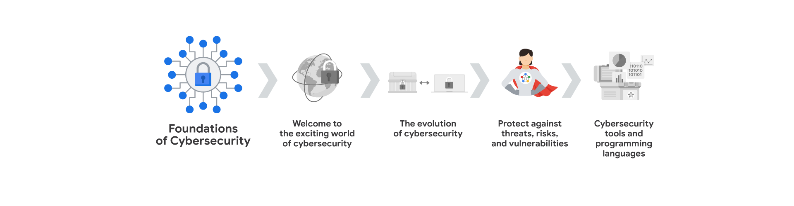

# Módulo 1: Bienvenido al apasionante mundo de la ciberseguridad

## Introduccion a la ciberseguridad
- **Ciberseguridad**: Es la proteccion de la informacion y los sistemas de computadoras de ataques no autorizados. La ciberseguridad consta de 3 pilares fundamentales:
      - **confidencialidad**: La informacion solo debe ser accesible para las personas autorizadas.
      - **integridad**: La informacion debe ser precisa y confiable.
      - **disponibilidad de la informacion**: La informacion debe estar disponible para las personas autorizadas cuando la necesiten.

### Tipos de amenasas
- **Internas**: Las amenasas son aquellas que provienen por parte de los ex-empleados que trabajaron en la empresa o por parte de los empleados actuales que trabajan en la empresa o socios e incluso hasta un proveedor de servicios. Puede ser intencional (robo de datos) o accidental (hacer clic en un enlace malicioso).
- **Externas**: Las amenasas son aquellas que provienen de personas ajenas a la empresa como los hackers, crackers, ciberdelincuentes, piratas informaticos, que buscan aprovecharse de las vulnerabilidades para obtener beneficios propios.

### Beneficios de la ciberseguridad
- **Proteccion de la informacion**: La ciberseguridad protege la informacion de los usuarios y de las empresas.
- **Proteccion de los sistemas**: La ciberseguridad protege los sistemas de computadoras de las empresas.
- **Mantenimiento de la confianza**: La ciberseguridad mantiene la confianza de los usuarios y de las empresas.

### Roles en ciberseguridad
- **Analista de seguridad**Enfocado en la proteccion de sistemas y datos de una organizacion. Esto incluye tareas como el analisis de riesgos y la implementacion de medidas de seguridad y la respuesta a incidentes de seguridad.
- **Analista de ciberseguridad**: Cumple funciones similares al de un analista de seguridad, pero con un enfoque mas especifico al las amenasas ciberneticas. Esto puede incluir el analisis de malware, la seguridad de la red.
- **Centro de operaciones de seguridad (SOC)**: Este equipo se encarga de motitorear y responde a las amenazas de seguridad en tiempo real.
- **Analista de seguridad de la informacion**: enfocado en la informacion confidencial de la organizacion. Esto incluye la implememntacion de politicas de seguridad, implementacion de controles de acceso.

### Preguntas y Respuestas

1. Pregunta 1: ¿Cuál es la diferencia entre una amenaza interna y una amenaza externa en ciberseguridad?
2. Pregunta 2: ¿Cuáles son los tres principios fundamentales de la seguridad de la información, a menudo conocidos como la tríada CIA?
3. Pregunta 3: Imagina que eres un analista de seguridad y observas un aumento repentino en el tráfico de red proveniente de una fuente desconocida. ¿Qué medidas tomarías para investigar y mitigar esta posible amenaza?
       - Respuesta
         - Identificar la fuente del tráfico: Analizar las direcciones IP, puertos y protocolos utilizados para determinar el origen del tráfico sospechoso.
         - Analizar el comportamiento del tráfico: Investigar si el tráfico coincide con patrones conocidos de ataques, como escaneo de puertos o intentos de acceso no autorizados.
         - Aislar el tráfico sospechoso: Si se confirma que el tráfico es malicioso, se deben tomar medidas para aislarlo de la red, como bloquear las direcciones IP o puertos de origen.
         - Investigar la causa raíz: Una vez contenido el ataque, es importante investigar cómo se originó la amenaza para prevenir futuros incidentes.
         - Documentar y reportar: Registrar todos los hallazgos y acciones tomadas para futuras referencias y para informar al equipo de seguridad y a la gerencia.
         - Dar aviso al SOC: Si el incidente es grave o requiere una respuesta inmediata, se debe notificar al Centro de Operaciones de Seguridad (SOC) para una intervención más especializada.
4. ¿Por qué es importante para una empresa mantener actualizados sus sistemas operativos y software?
    - Mantener los sistemas operativos y el software actualizados es crucial para la seguridad de una empresa porque las actualizaciones suelen incluir parches de seguridad que corrigen vulnerabilidades conocidas.
    - Al no actualizar, las empresas se exponen a un mayor riesgo de ataques cibernéticos, ya que los atacantes buscan activamente explotar estas vulnerabilidades.

### Terminología común sobre ciberseguridad

- Cumplimiento Normativo: Se refiere al cumplimiento de las leyes y regulaciones relacionadas con la seguridad de la información. Permitiedole a las organizaciones evitar sanciones y multas por incumplimiento.
- Marcos de Seguridad: Son marcos de trabajo que proporcionan un conjunto de controles y mejores prácticas para proteger la información y los sistemas de una organización.
- Controles de Seguridad: Son medidas y procedimientos que se implementan para proteger los activos de una organización y mitigar los riesgos de seguridad.
- Postura de Seguridad: Es la capacidad que tiene una organizacion para gestionar su defensa de activos y datos criticos.
- Agente de Amenaza o Atacante Malicioso: Es una persona o grupo que representa un riesgo para la seguridad de una organizacion al intentar comprometer sus sistemas y datos.
- Amenaza Interna: Es una amenaza que proviene por parte de un ex-exempleado o empleado actual de la empresa, estas amenazas pueden darse ya sea de manera intencional o accidental.
- Seguridad de la Red: Es mantener la infraestructura de red de una organizacion de accesos no autorizados y ataques maliciosos.
- Seguridad de la nube: Es proteger los datos y aplicaciones almacenados en la nube, asegurando que solo las personas autorizadas tengan acceso a ellos. La nube es un subcampo de la ciberseguridad que se enfoca en proteger los recursos de computación en la nube de los ataques cibernéticos.
- La programacion: Es el proceso de escribir instrucciones para que una computadora realice una tarea específica o repetitiva. Como ser la automatizacion de tareas repetitivas en ciberseguridad, revicion de trafico de red, alerta de actividades sospechosas.

### Competencias basicas para los profecionales de la ciberseguridad:
- **Habilidades Transferibles**: Son habilidades de otras areas que se aplican a diferentes carreras, como la resolucion de problemas, la comunicacion, la colaboracion, getion del tiempo, mentalidad de crecimiento y diversidad de perspectivas.
  - **Comunicacion**: Saber comprender los problemas y saber comunicarlos de manera clara y concisa de manera de que tanto las personas que tengan conocimientos tecnico y aquellos que no lo tengan puedan entenderlo.
  - **Resolucion de Problemas**: Saber identificar los problemas y encontrar soluciones efectivas, ademas de ser capaz de adaptarse a situaciones cambiantes. Puede hacerlo reconociendo patrones para luego determinar una solucion efectiva.
  - **Colaboracion**: Saber trabajar en equipo y ser capaz de colaborar con otros profesionales para lograr un objetivo comun.
  - **Gestion del tiempo**: Saber administrar el tiempo de manera eficiente y priorizar las tareas segun su importancia y urgencia.
  - **Mentalidad de crecimiento**: Estar dispuesto a aprender y a mejorar constantemente, ademas de ser capaz de adaptarse a los cambios y desafios.
  - **Diversidad de perspectivas**: Ser capaz de ver las cosas desde diferentes puntos de vista y apreciar la diversidad de opiniones y experiencias, fomentando la inclusion, la equidad y el respeto por los demas.
- **Habilidades tecnicas**: tambien pueden ser aplicables a barias areas pero sin embargo a veces se pueden requerir el conocimiento de ciertas herramientas como ser: Herramientas de administracion de eventos e informacion de seguridad (SIEM), Sistemas de deteccion de intrusiones (IDS), Sistemas de prevencion de intrusiones (IPS), Conocimiento sobre el panorama de las amenazas, Respuestas ante incidentes, lenguajes de programacion.
  - **Herramientas de administracion de eventos e informacion de seguridad (SIEM)**: Son herramientas que permiten a los profesionales de la ciberseguridad monitorear y analizar los eventos de seguridad en tiempo real, lo que les permite detectar las posibles amenazas, riesgos, vulnerabilidades de la seguridad con mayor eficacia.
  - **Sistemas de deteccion de intrusiones (IDS)**: Son sistemas que monitorean y analizan el tráfico de red en busca de actividades sospechosas o maliciosas, como intentos de acceso no autorizados o ataques de denegación de servicio.
  - **Sistemas de prevencion de intrusiones (IPS)**: Son sistemas que detectan y bloquean automáticamente las amenazas de seguridad en tiempo real, protegiendo los sistemas y datos de una organización contra ataques cibernéticos.
  - **Conocimiento sobre el panorama de las amenazas**: Es importante que los profesionales de la ciberseguridad estén al tanto de las últimas tendencias y amenazas en el campo de la ciberseguridad, para poder anticipar y mitigar posibles riesgos de seguridad ante nuevas variantes de malware, ataques de phishing, ransomware entre otros.
  - **Respuestas ante incidentes**: Los profesionales de la ciberseguridad deben estar preparados para responder rápidamente a los incidentes de seguridad, investigar las causas raíz y tomar medidas correctivas para minimizar el impacto de los ataques cibernéticos.
### CompTIA Seguridad+
- **CompTIA Security+**: Es una certificacion de seguridad de la informacion que valida las habilidades y conocimientos de los profesionales de la ciberseguridad en areas como la identificacion de amenazas, la implementacion de controles de seguridad y la respuesta a incidentes de seguridad.
### Términos y definiciones del Curso 1, Módulo 1
- **Ciberseguridad (o seguridad)**: La práctica de garantizar la confidencialidad, integridad y disponibilidad de la información protegiendo las redes, los dispositivos, las personas y los datos del acceso no autorizado o de la explotación delictiva
- **Seguridad de la nube**: El proceso de garantizar que los recursos almacenados en la Nube están configurados correctamente y que el acceso a dichos recursos está limitado a los usuarios autorizados
- **amenaza interna**: Un empleado actual o anterior, un proveedor externo o un socio de confianza que supone un riesgo para la Seguridad.
- **Amenaza externa**: Un atacante malicioso que no tiene relación con la organización y que intenta explotar las vulnerabilidades de la organización para obtener beneficios personales.
- **Seguridad de la red**: La práctica de mantener la infraestructura de red de una organización a salvo de accesos no autorizados.
- **Informacion de identificacion personal (PII)**: Cualquier Información utilizada para inferir la identidad de un individuo
- **Informacion de identificacion personal sensible (SPII)**: Un tipo específico de PII que entra dentro de las directrices de manejo más estrictas. Información de identificación personal que puede ser utilizada para cometer fraude o robo de identidad
- **Postura de seguridad**: La capacidad de una organización para gestionar su defensa de activos y datos críticos y reaccionar ante los cambios
- **Habilidades Tecnicas**: Habilidades que requieren el conocimiento de herramientas, Procedimientos y políticas específicas para realizar tareas específicas.
- **Habilidades Transferibles**: Habilidades que se pueden aplicar a diferentes carreras y campos.
- **Amenaza**: Cualquier circunstancia o evento que puede impactar negativamente en los recursos de una organización.
- **Agente de amenaza**: Cualquier persona o grupo que presente un riesgo para la seguridad de una organización.
- **Marco de seguridad**: Un conjunto de controles y mejores prácticas que se utilizan para proteger la información y los sistemas de una organización.
- **Controles de seguridad**: Medidas y procedimientos que se implementan para proteger los activos de una organización y mitigar los riesgos de seguridad.
- **Cumplimiento normativo**: El cumplimiento de las leyes y regulaciones relacionadas con la seguridad de la información.

# Módulo 2: La evolución de la ciberseguridad

# Módulo 3: Proteger contra amenazas, riesgos y vulnerabilidades

# Módulo 4: Herramientas de ciberseguridad y lenguajes de programación

### Apendice

- [Plan de estudio](https://www.coursera.org/learn/foundations-of-cybersecurity/ungradedWidget/XkeaO/your-google-cybersecurity-certificate-roadmap#)

- **(CID)** modelo de seguridad fundacional denominado Tríada de confidencialidad, integridad y disponibilidad
- **(SIEM)** Herramientas de administración de eventos e información de seguridad
