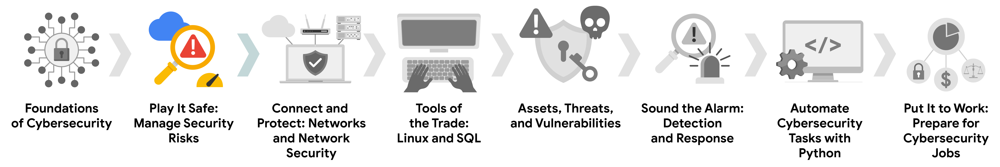
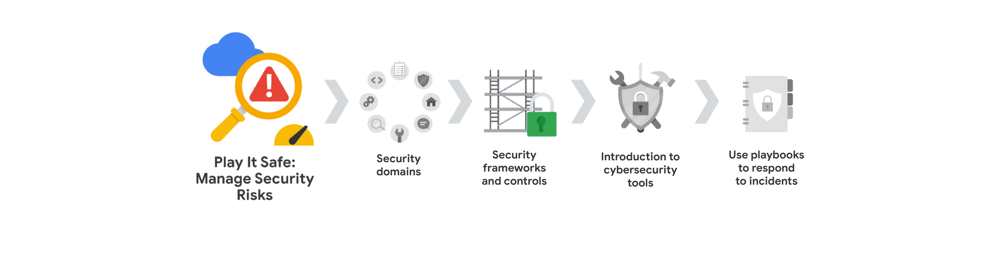
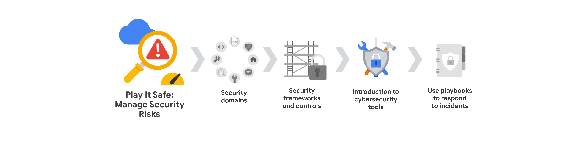
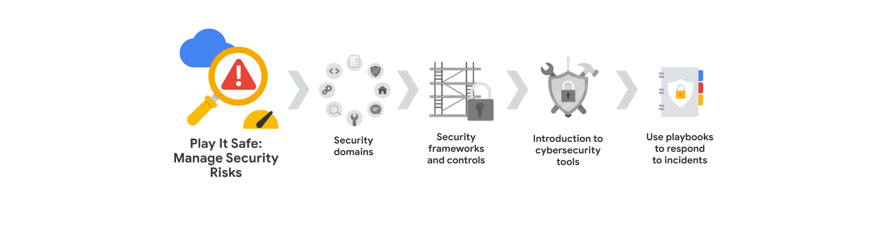

<h1 align="center">
Gestione los riesgos de seguridad
</h1>

Identifique cómo los profesionales de la ciberseguridad utilizan los marcos y controles para proteger las operaciones empresariales, y explore las herramientas comunes de ciberseguridad.

# Habilidades que se obtiene
  * Seguridad de la información (INFOSEC)
  * Marco de gestión de riesgos del NIST (RMF)
  * Auditorías de seguridad
  * Marco de Ciberseguridad del NIST (CSF)
  * Guías de respuesta a incidentes

# **Modulo 1**: Dominios de Seguridad

    Conocerá los ocho dominios de Seguridad del CISSP. A continuación, conocerá las principales amenazas, riesgos y vulnerabilidades de las operaciones empresariales. Además, explorará el Framework de Gestión de Riesgos del Instituto Nacional de Estándares y Tecnología (NIST) y los pasos de la gestión de riesgos.

## Mas informacion sobre los Dominios de Seguridad:

Utilizados para organizar tareas diarias e identificar las brechas en la seguridad, las cuales podrian causar consecuencias negativas para una organización y para establecer su [postura de seguridad](#postura-de-seguridad)

### 1. Gestion de Seguridad y Riesgos:

Este Dominio implica establer metas y objetivos de seguridad, la mitigacion de riesgos, cumplimiento normativo , continuidad del negocio y regulaciones legales.

* **metas y objetivos de seguridad**: Establecer metas y objetivos le permite a la organizacion reducir los riesgos para los recursos, datos criticos com la PII (Informacion de Identificacion Personal) y la propiedad intelectual.
* **Mitigar los Riesgos**: Disponer de los procedimientos y normas para reducir el impacto de los riesgos en la organizacion.
* **Cumplimiento Normativo**: Utilizado para el desarrollo de las politicas de seguridad, requisitos reglametarios y las normas independientes de una organizacion.
* **Continuidad del Negocio**: Es la capacidad que tiene una organizacion para matener su productividad ante desastres por riesgos, esto ante el establecimiento de planes de recuperacion.
* **Regulaciones Legales**: Se refiere al cumplimiento de las leyes y normas establecidas por el gobierno y las organizaciones reguladoras para proteger los datos y la informacion de los usuarios.

### 2. Seguridad de los Activos:

Centrado en la proteccion de los activos digitales y fisicos, tambien incluye el almacenamiento, mantenimiento, retencion y destruccion de los activos. Permitiendo que los PII, SPII sean manejados de manera segura. saber cuales son los datos que se tienen y donde se encuentran es una postura de seguridad solida para una organizacion. Se centra en 3 objetivos principales:

* **Identificar**: Reconocer y clasificar todos los activos digitales y físicos de la organización, incluyendo datos, sistemas, hardware y software.
* **Proteger**: Implementar medidas de seguridad para proteger los activos contra accesos no autorizados, uso indebido, divulgación, modificación o destrucción
* **Gestionar**: Establecer políticas y procedimientos para el manejo adecuado de los activos a lo largo de su ciclo de vida, incluyendo almacenamiento, acceso, uso, retención y eliminación.

### 3. Arquitectura de Seguridad e Ingenieria: 

Centrado en la optimizacion de la seguridad garantizando que existen herramientas, sistemas y procesos eficaces para la proteccion de los recursos de la organizacion. Por ejemplo, un analista de seguridad puede ser responsable de garantizar que los sistemas de la organización estén protegidos contra amenazas y vulnerabilidades. Esto puede incluir la implementación de firewalls, sistemas de detección de intrusiones y sistemas de prevención de intrusiones. Uno de los conceptos de la arquitectura de diseño es la [**Responsabiliddad Compartida**](#responsabilidad-compartida)

### 4. Seguridad de las Comunicaciones y Redes:

Centrado en la proteccion de las redes fisicas que permite mantener los datos a salvo, y las comunicaciones inalambricas 

### 5. Gestion de Identidad y Acceso (IAM):

Centrado en el acceso y la autorizacion de los usuarios, para gestionar y controlar los activos de la organizacion. Es escencial mantener los datos seguros como sea posible, asegurando que los usuarios solo tengan acceso a los datos que necesitan para realizar su trabajo. Tiene 4 componnetes principales:

* **Identificación**: Es el proceso de identificar a los usuarios y verificar su identidad, a travez de un nombre de usuario.
* **Autenticación**: Proceso de verificacion para provar la identidad de un usuario (contraseña, pin).
* **Autorización**: Proceso de determinar que recursos y datos tiene acceso un usuario.
* **Responsabilidad**: Supervicion y los registros de las actividades de los usuarios.

### 6. Evaluacion y pruebas de Seguridad:

Centrado en la realizacion de pruebas de control de seguridad, recopilacion, analisis de datos y la realizacion de auditorias de seguridad, ayudandoles a identificar nuevas y mejores formas de mitigar las amenasas, riesgos y vulnerabilidades, probar la eficacia de los controles de seguridad existentes, descubrir vulnerabilidades antes de que puedan ser explotadas por atacantes.

### 7. Operaciones de Seguridad:

Centrado en investigar e implementar medidas preventivas. La investigacion inicia cuando sucede un incidente de seguridad, una vez neutralizada la amenaza inicia la recopilacion de pruebas para llevar a cabo una investigacion forense. Esto les ayudara a determinar areas de mejora y a prevenir futuros incidentes.

### 8. Seguridad en el Desarrollo de Software:

Centrado en el uso de practicas de [programacion seguras](#programacion-segura). Los profesionales de la ciberseguridad deben asegurarse de que los desarrolladores de software sigan las mejores prácticas de seguridad al crear aplicaciones y servicios. Esto incluye la codificación segura, la revisión de código y las pruebas de seguridad. es decir el uso de ciclo de vida del desarrollo de software. 

## Amenazas, Riesgos y Vulnerabilidades

* **Amenaza**: Cualquier circunstancia o evento que pueda afectar negativamente a los activos de una organización. Ejemplo: ataques de ingeniería social como el phishing.
* **Riesgo**: La probabilidad de que una amenaza se materialice, afectando la confidencialidad, integridad o disponibilidad de un activo. Ejemplo: Falta de protocolos de respaldo.
* **Vulnerabilidad**: Una debilidad que puede ser explotada por una amenaza. Para que exista un riesgo, debe haber tanto una amenaza como una vulnerabilidad. Ejemplos: firewalls obsoletos, contraseñas débiles, datos confidenciales sin protección.
### Niveles de Riesgo de los Activos

* **Bajo**: Información pública que no causaría daños significativos si se viera comprometida. Ejemplo: contenido del sitio web.
* **Medio**: Información no pública que podría causar algunos daños a las finanzas, la reputación o las operaciones de la organización. Ejemplo: publicación anticipada de las ganancias trimestrales de una empresa.
* **Alto**: Información protegida por leyes o regulaciones, cuya violación tendría un impacto severo en la organización. Ejemplo: filtración de datos con información de identificación personal (PII) o propiedad intelectual.
### El Papel del Analista de Seguridad de Nivel Inicial

* **Identificar y mitigar vulnerabilidades**: Monitorear y documentar el acceso a activos críticos, fomentar la denuncia de actividades sospechosas.
* **Educar y empoderar a los empleados**: Brindar capacitación sobre seguridad, como identificar correos electrónicos de phishing, para promover una cultura de seguridad.
Recuerda, la gestión eficaz de las amenazas, los riesgos y las vulnerabilidades es crucial para proteger los activos de una organización.

## Impactos clave de las amenazas, Riesgos y vulnerabilidades

* **¿Qué es el ransomware?**: 
  * Es una ataque malicioso en la cual los atacantes encriptan los datos para luego exigir un pago para restaurar el acceso a los datos.
  * Los actores de amenazas pueden usar la dark web para negociar rescates o filtrar datos robados.
* **¿Qué es la web?**: La web es una red interconetada de contenidos en linea, que permite a los usuarios acceder a la informacion y a los servicios a travez de un navegador web. Eso lo que generalmente conocemos, pero esto en realidad esta compuesto por 3 capas:
  * **La web de superficie**: es la capa que utiliza la mayoría de la gente. Contiene contenidos a los que se puede acceder utilizando un navegador web.
  * **La web profunda**: es la capa que no se puede indexar por los motores de busqueda. Contiene contenido que no esta disponible para el publico en general, un ejemplo claro seria la intranet de una organizacion.
  * **La web profunda o dark web**: es la capa que no se puede acceder a travez de los navegadores web convencionales. Contiene contenido que no esta indexado por los motores de busqueda y que requiere software especial para acceder a ella. Es un lugar donde los actores de amenazas pueden comprar y vender datos robados, herramientas de hacking y servicios de hacking. Esto gracias al secretismo y el anonimato que ofrece la red TOR.
* **Impacto de las amenazas, los riesgos y las vulnerabilidades**:
  * **Impacto financiero**:  Los ataques pueden interrumpir las operaciones, costar dinero para corregirlos y generar multas por incumplimiento.
  * **Robo de Identidad**: Los datos confidenciales, como la información de identificación personal (PII), pueden ser robados y vendidos o filtrados en la dark web.
  * **Daño a la reputación**: Los ataques pueden dañar la reputación de una organización y la confianza de los clientes. Las vulnerabilidades explotadas pueden llevar a la pérdida de clientes, mala prensa y daños duraderos a la reputación de una organización.
## Marco de gestión de riesgos del NIST

* **Marco de gestion de riesgos RMF**: Existen 7 pasos en el marco de gestion de riesgos del NIST:
  * **Preparar**: Alistarse para gestionar los riesgos de seguridad y privacidad.
  * **Categorizar**: Desarrollar procesos y tareas de gestion de riesgos.
  * **Seleccionar**: Elegir y documentar los controles de seguridad apropiados.
  * **Implementar**: Disponer de buenos planes es escencial para minimizar el impacto de los riesgos de seguridad. Se trata de poner en práctica los controles de seguridad seleccionados. Es decir, pasar de la planificación a la acción.
  * **Evaluar**:  Determinar la eficacia de los controles, procedimientos y protocolos implementados.
  * **Autorizar**: Implica la generacion de informes, desarrollo de planes de accion y el establecimiento de hitos del proyecto. Aprobar el nivel de riesgo residual. Se refiere a la decisión formal de aceptar el nivel de riesgo residual después de que los controles se han implementado. Es decir, alguien con la autoridad correspondiente debe dar el visto bueno, reconociendo que se ha hecho todo lo posible para mitigar los riesgos dentro de los límites establecidos.
  * **Supervisar**: Realizar un seguimiento de del funcionamiento de los sistemas, la evaluacion y el matenimiento de la  operaciones tecnicas y de seguridad.

## Términos y definiciones del Curso 2, Módulo 1

* **Evaluar**: El quinto paso del RMF del NIST que significa determinar si los controles establecidos se implementan correctamente

* **Autorizar**: El sexto paso del NIST RMF que se refiere a ser responsable de los riesgos de Seguridad y privacidad que puedan existir en una organización

* **Continuidad del negocio**: La capacidad de una organización para mantener su productividad diaria mediante el establecimiento de planes de recuperación ante desastres de riesgo

* **Categorizar**: El segundo paso del NIST RMF que se utiliza para desarrollar procesos y tareas de gestión de riesgos

* **Amenaza externa**: Cualquier cosa fuera de la organización que tenga el potencial de dañar los recursos de la organización

* **Implementar**: El cuarto paso del RMF del NIST que significa implementar planes de Seguridad y privacidad para una organización

* **Amenaza interna**: Un empleado actual o anterior, un proveedor externo o un socio de confianza que suponga un riesgo para la Seguridad

* **Monitorear**: El séptimo paso del NIST RMF que significa ser consciente de cómo están funcionando los sistemas

* **Preparar**: El primer paso del NIST RMF relacionado con las actividades que son necesarias para gestionar los riesgos de seguridad y privacidad antes de que se produzca una brecha

* **Ransomware**: Un ataque malicioso en el que los agentes de amenaza encriptan los Datos de una organización y demandan un pago para restaurar la accesibilidad.

* **Riesgo**: Cualquier cosa que pueda afectar a la confidencialidad, integridad y disponibilidad de un recurso

* **Mitigación de riesgos**: El proceso de disponer de los procedimientos y normas adecuados para reducir rápidamente el impacto de un riesgo como una violación de seguridad

* **Postura de seguridad**: La capacidad de una organización para gestionar su defensa de los activos y datos críticos y reaccionar ante los cambios

* **Seleccionar**: El tercer paso del NIST RMF que significa elegir, personalizar y capturar la documentación de los controles que protegen a una organización

* **Responsabilidad compartida**: La idea de que todos los individuos de una organización asuman un papel activo en la reducción del riesgo y el mantenimiento de la Seguridad tanto física como virtual

* **Ingeniería social**: Una técnica de manipulación que explota el error humano para obtener información privada, acceso u objetos de valor

* **Vulnerabilidad**: Una debilidad que puede ser explotada por una amenaza

# **Modulo 2**: Marcos de Seguridad y Controles

    Se centrará en los marcos y controles de Seguridad, junto con los componentes básicos de la tríada Confidencialidad, integridad y disponibilidad (CID). Aprenderá sobre los principios de seguridad y las auditorías de seguridad del Proyecto de Seguridad de Aplicaciones Web Abiertas (OWASP).

## Frameworks (Marcos) de Seguridad:

* Importancia de los marcos de seguridad:
  * Los marcos de seguridad presentan pautas para desarrollar planes que ayudan a mitigar los riesgos y amenazas a los datos y la privasidad, incluyendo ataques de ingenieria social y ransomware.
  * Los marcos de seguridad no solo estan enfocados en la proteccion en el espacio virtual, tambien concideran la seguridad fisica como el control de acceso a los edificios por medio de tarjetas de acceso o credenciales.
* El factor humano en la seguridad:
  * Los empleados son a menudo el punto mas vulnerable en la seguridad de una organizacion.
  * Los marcos de seguridad pueden ayudar a crear planes para aumentar la conciencia de los empleados y educarlos sobre cómo proteger la organización, a sus compañeros de trabajo y a sí mismos. 
* Algunos marcos de Seguridad:
  * **Marco de la Amenaza Cibernetica (CTF)**: Desarrollado por el gobierno de EE.UU. Este marco proporciona un lenguaje comun para describir y comunicar informacion sobre actividades de amenazas ciberneticas.
  * **Organización Internacional de Normalización/Comisión Electrotécnica Internacional (ISO/IEC) 27001**: Es un estandar internacional lo permite a las organizaciones gestionar la seguridad de los recursos (informacion financiera, los datos de empleados y la informacion confiada a terceros) 

## Controles de Seguridad:

* Importancia de los controles de seguridad:
  * Lo controles de seguridad a diferencia de los marcos estas se concideran mas como salvaguardas diseñadas para reducir riegos de seguridad mas especificos. Existen controles como ser: Encriptacion, autenticacion y la autorizacion.
  * Si los controles no son implementado de manera adecuada en una organizacion, entonces las organizaciones pueden llegar enfrentarse a importantes repercuciones financieras y tambien daños a la reputacion.
* Tipos de controles de seguridad:
  * **La encriptacion**: Es el procesos de convertir datos legibles en un formato ilegible conocido como texto cifrado. Lo cual es una forma de proteger los datos de los usuarios, ya que es ilegible para humanos y ordenadores.
  * **Autenticacion**: Es el proceso de verificar la identidad  de quien es alguien, garantizando que solo los usuarios autorizados tengan acceso a los datos y a los recursos de la organizacion. WExisten algunos metodos mas avanzados como la autenticacion de dos factores (MFA) los cuales desafian al usuario para que demuestre quien dice ser por medio de un codigo de seguridad, datos biométricos o una tarjeta de acceso.
  * **Autorizacion**: Es el proceso que determina quien tiene acceso a los datos y a los recursos de la organizacion. La autorizacion se basa en la autenticacion, ya que los usuarios deben demostrar su identidad antes de que se les conceda acceso a los datos y a los recursos.
* Los controles pueden ser:
  * **Fisicos**:
    * puertas, ballas y cerraduras
    * Guardias de seguridad
    * Circuitos cerrados de television (CCTV), camaras de vigilancia y detectores de movimiento
    * Tarjetas de acceso y credenciales
  * **Tecnicos**:
    * Firewalls
    * MFA
    * Software antivirus
  * **Administrativos**:
    * Separacion de funciones
    * Autorizacion y autenticacion
    * Clasificacion de Activos
  
## La tríada CID
- **¿Qué es la tríada CIA?**:
  * Es un modelo que ayuda a informar de como las organizaciones consideran los riesgos al establecer servicios y politicas de seguridad
    * **Confidencialidad**: Garantiza que los datos solo esten disponibles para las personas autorizadas. Un ejemplo de cómo las organizaciones logran esto es mediante el principio de privilegio mínimo.
    * **Integridad**: Garantiza que los datos sean autenticos, correctos y confiables, es decir libre de modificaciones no deseados. La criptografía y el cifrado son métodos clave utilizados para mantener la integridad de los datos.
    * **Disponibilidad**: Garantiza que los datos esten disponibles para las personas autorizadas cuando lo necesiten.
* **Importancia de la tríada CID**:
  * Comprender y aplicar la tríada **CID** ayuda a los profesionales de seguridad a protegerse contra amenazas como la ingeniería social, el malware y el robo de datos.
  * Tener presente la tríada CID facilita la toma de decisiones informadas sobre la protección de datos y activos.

## Marcos de trabajo de seguridad:
  * Las organizaciones utilizan marcos de trabajo como el NIST Cybersecurity Framework (CSF) para gestionar los riesgos de ciberseguridad.
  * Estos marcos de trabajo ofrecen estándares, directrices y mejores prácticas para crear planes de seguridad.
- El NIST CSF en acción
  - El CSF incluye cinco funciones principales: identificar, proteger, detectar, responder y recuperar.
- **Cómo se utiliza cada función para mejorar la seguridad**:
  - **Identificar**: Administrar el riesgo de ciberseguridad y su efecto en las personas y los activos de una organización.
  - **Proteger**: Implementar políticas, procedimientos, capacitación y herramientas para mitigar las amenazas de ciberseguridad.
  - **Detectar**:  Identificar posibles incidentes de seguridad y mejorar las capacidades de monitorización.
  - **Responder**: Contener, neutralizar y analizar los incidentes de seguridad e implementar mejoras en el proceso de seguridad.
  - **Recuperar**: Devolver los sistemas afectados a su funcionamiento normal.
- Beneficios y alcance de los marcos de trabajo del NIST
  - El NIST CSF ayuda a las organizaciones a responder a incidentes de forma rápida y adecuada, reduciendo riesgos y vulnerabilidades.
  - Otro marco de trabajo, el NIST SP 800-53, se centra específicamente en la protección de los sistemas de información del gobierno federal de los Estados Unidos.

## Pricipios OWASP y Auditorias de Seguridad:

Owasp en una organizacion que tiene como objetivo mejorara la seguridad del software, tiene como micion crear y mantener recursos que permitan a los desarrolladores, arquitectos de software, y profesionales de la seguridad desarrollar aplicaciones más seguras y comprender mejor las amenazas a las que estas se enfrentan.

* **Principios de OWASP**:
    * **Minimizar la Superficie de ataque**: Una superficie de ataque hace referencia a todos los lugares que el agente de amenaza podria llegar a explotar. Como los vectores de ataque que son utilizadas como caminos para llegar a los datos (correos electronicos, phishing, contraseñas debiles).
    * **Privilegio Minimo**: Se refiere a que un usuario debe tener la menor cantidad de acceso posible a los datos y a los recursos de la organizacion para realizar su trabajo de manera eficiente.
    * **Defensa en Profundidad**: Indica que una organizacion debe tener multiples controles de seguridad que aborden los riesgos y amenazas de seguridad en diferentes capas de la organizacion. Un ejemplo puede llegar a ser el control de autenticacion de multiples factores (MFA), firewalls y sistemas de deteccion de intrusiones.
    * **Separacion de Funciones**: Este principio se basa en que **a nadie se le debe dar muchos privilegios que pueda hacer un mal uso del sistema**, esto puede llegar a resultar muy utili al momento de prevenir actividades fraudulentas o ilegales. Por ejemplo, la persona de una empresa que firma las nóminas no debería ser también la persona que las prepara.
    * **Mantener la Seguridad Simple**: Evitar las soluciones de seguridad complicadas e innecesarias porque estas pueden llegar a ser inmanejables y dificiles de mantener.
    * **Solucionar los Problemas de Seguridad**: Es muy importante solucionar los problemas de seguridad y aun mas cuando se produce un incidente de seguridad. Un ejemplo de problema es una contraseña débil para acceder al wifi de una organización porque podría dar lugar a una brecha. Para solucionar este tipo de Problema de Seguridad, se podrían establecer políticas de contraseñas más estrictas.

## Planificacion de una auditoria de seguridad:

* **¿Qué es una auditoría de seguridad?**:
    * Es una revicion de los controles, procedimientos, y politicas de seguridad, existen dos tipos de auditorias de seguridad:
      * **Auditoria Interna**: Realizada por los empleados de la organizacion.
      * **Auditoria Externa**: Realizada por un tercero.
    * **Auditorias Internas**: Son realizadas por los empleados de la organizacion. Estas auditorias se realizan con el objetivo de mejorara las posturas de seguridad y evitar multas de las agencias gubernamentales por incumplimiento de las normas de seguridad.
    * **Planificacion de una auditoria Interna**: Existen algunso elementos muy importantes de la auditorias internas y son: establecer el alcance y los objetivos de la auditoría, realizar una evaluación de riesgos de los activos de la organización, completar una evaluación de controles, evaluar el cumplimiento y comunicar los resultados a la parte interesada.
      * * **Establecer el alcance y los objetivos**: Se parte por definir el alcance de una auditoria de sistemas es decir a quienes se llegara a auditar (empleados, políticas, activos, procedimientos y tecnologías), y posteriormente definir los objetivos lo que nos permite saber que se espera lograr con la auditoria.
      * **Realizar una evaluacion de riesgos**: Se centra en la identificacion de amenazas, riesgos y vulnerabilidades, lo cual les permite ver a los analistas ver que medidas de seguridad se deben implementar y cuales se deben mejorar.
      * **Evaluacion de Controles**: implica la revision en detalle de los activos de una organizacion, evalua los riesgos potenciales para los activos

## Términos y definiciones del Curso 2, Módulo 2

* **Recurso** : Elemento que se percibe como poseedor de valor para una organización

* **Vectores de ataque**: Las vías que utilizan los atacantes para penetrar las defensas de Seguridad

* **Autenticación**: El proceso de verificar quién es alguien

* **Autorización**: El concepto de conceder acceso a recursos específicos en un sistema

* **Disponibilidad**: La idea de que los datos son accesibles para aquellos que están autorizados a acceder a ellos

* **Datos biométricos**: Las características físicas únicas que pueden utilizarse para verificar la identidad de una persona

* **Confidencialidad**: La idea de que sólo los usuarios autorizados pueden acceder a recursos o Datos específicos

* **Tríada de confidencialidad, integridad y disponibilidad (CID)**: Modelo que ayuda a informar sobre cómo las organizaciones tienen en cuenta el riesgo a la hora de establecer sistemas y políticas de Seguridad

* **Detectar**: Una función central del NIST relacionada con la identificación de posibles incidentes de Seguridad y la mejora de las capacidades de Monitoreo para aumentar la Velocidad y la Eficiencia de las Detecciones

* **Encriptación**: El proceso de convertir datos de un formato legible a un formato codificado

* **Identificar**: Una función central del NIST relacionada con la gestión del riesgo de ciberseguridad y su efecto sobre las personas y los recursos de una organización

* **Integridad**: La idea de que los datos son correctos, auténticos y fiables

* **Marco de Ciberseguridad (CSF) del Instituto Nacional de Estándares y Tecnología (NIST)**: Un framework voluntario que consiste en estándares, directrices y mejores prácticas para gestionar el riesgo de la ciberseguridad

* **Publicación Especial (S.P.) 800-53 del Instituto Nacional de Estándares y Tecnología (NIST )**: Un marco unificado para proteger la seguridad de los sistemas de información dentro del gobierno federal de EE.UU.

* **Proyecto Abierto de Seguridad en Aplicaciones Web/Proyecto Abierto de Seguridad en Aplicaciones Web (OWASP)**: Una organización sin ánimo de lucro centrada en mejorar la Seguridad del software

* **Proteger**: Función principal del NIST utilizada para proteger una organización mediante la implementación de políticas, Procedimientos, Entrenamiento y Herramientas que ayudan a mitigar las amenazas a la ciberseguridad

* **Recuperar**: Una función central del NIST relacionada con el retorno de los sistemas afectados a su funcionamiento normal

* **Responder**: Una función central del NIST relacionada con asegurarse de que se utilizan los procedimientos adecuados para contener, neutralizar y analizar los incidentes de seguridad, e implementar mejoras en el proceso de seguridad

* **Riesgo**: Cualquier cosa que pueda afectar a la confidencialidad, integridad y disponibilidad de un recurso

* **Auditoría de seguridad**: Revisión de los Controles de seguridad, políticas y Procedimientos de una organización frente a un conjunto de expectativas

* **Controles de seguridad**: Salvaguardas diseñadas para reducir riesgos de Seguridad específicos

* **Marcos de seguridad**: Directrices utilizadas para elaborar planes que ayuden a mitigar el riesgo y las amenazas a los Datos y a la privacidad

* **Postura de seguridad**: La capacidad de una organización para gestionar su defensa de los activos y datos críticos y reaccionar ante los cambios

* **Amenaza**: Cualquier circunstancia o Evento que pueda impactar negativamente en los recursos

# **Modulo 3**: Introduccion a las Herraientas de Ciberseguridad

    Explorará las herramientas de gestión de información y eventos de seguridad (SIEM) líderes del sector que utilizan los profesionales de la seguridad para proteger las operaciones empresariales. Aprenderá cómo los analistas de seguridad de nivel básico utilizan los cuadros de mando SIEM como parte de su trabajo diario.

# **Modulo 4**: Utilice Manuales de Estragias para Responder a Incidentes

    Aprenderá sobre los propósitos y usos comunes de los manuales de estrategias. También explorará cómo los profesionales de la ciberseguridad utilizan los libros de jugadas para responder a las amenazas, riesgos y vulnerabilidades identificados.

# <h1 align="center" style="font-weight: bold">Glosario de terminos</h1>

### Postura de seguridad
* Es la capacidad que tiene una organizacion para gestionar sus defensas de los activos y datos criticos y reaccionar ente los cambios.

### Responsabilidad Compartida
* Es un modelo de seguridad en el que tanto el proveedor de servicios en la nube como el cliente son responsables de la seguridad de los datos y la proteccion de los activos o significa que todas las personas de una organización asumen un papel activo en la reducción del Riesgo y en el mantenimiento de la Seguridad tanto física como virtual.

### Programacion Segura
* Son directrices recomendadas utilizadas para la creacion de aplicaciones y servicios seguros. 