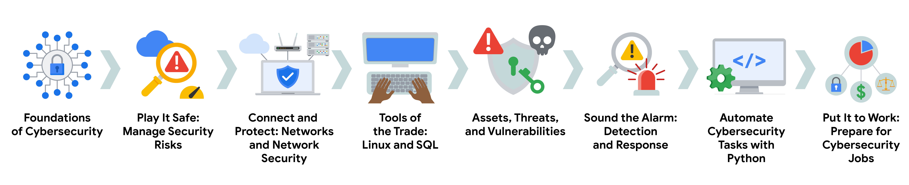

# Google Course Cybersecurity

Este programa se compone en el aprendisaje del area de la siberseguridad, en el cual se aprende a proteger la informacion de los usuarios y de las empresas. Aprendera temas como:

- Conceptos basicos de la ciberseguridad
- Dominios de Seguridad
- Seguridad de la red
- Conceptos basicos de computacion
  - Hardware
  - Software
  - Sistemas operativos (Linux y Windows)
- Comprender los Activos de la Informacion
- Las amenazas y las vulnerabilidades
- Deteccion y respuesta a incidentes
- Uso de lenguajes de programacion como Python

La certificacion de Google Cybersecurity Certificate es un programa de 8 cursos que se enfoca en la seguridad de la informacion y la proteccion de los sistemas.

1. [Fundamentos de la Ciberseguridad](https://www.coursera.org/learn/foundations-of-cybersecurity/home/week/1): Explore la profesión de la ciberseguridad, incluidos los acontecimientos significativos que condujeron al desarrollo del campo de la ciberseguridad y su continua importancia para las operaciones de las organizaciones. Conozca las funciones y responsabilidades de la ciberseguridad a nivel de principiante.
2. [Juegue sobre seguro: Gestione los riesgos de seguridad](https://www.coursera.org/learn/manage-security-risks/home/week/1): Identifique cómo los profesionales de la ciberseguridad utilizan los marcos y controles para proteger las operaciones empresariales y explore las herramientas comunes de ciberseguridad.
3. [Conectar y Proteger: Redes y Seguridad de red](https://www.coursera.org/learn/networks-and-network-security/home/week/1):Conozca las vulnerabilidades a nivel de red y cómo proteger las redes.
4. [Herramientas del oficio: Linux y SQL](https://www.coursera.org/learn/linux-and-sql/home/week/1): Explore los conocimientos básicos de informática, incluida la comunicación con el sistema operativo Linux a través de la línea de comandos y la consulta de bases de datos con SQL.
5. [Activos, amenazas y vulnerabilidades](https://www.coursera.org/learn/assets-threats-and-vulnerabilities/home/week/1): Conozca la importancia de los Controles de seguridad y el desarrollo de una mentalidad de Agente de amenaza para proteger y defender los recursos de una organización frente a diversas amenazas, riesgos y vulnerabilidades.
6. [Haga sonar la alarma: Detección y Respuesta](https://www.coursera.org/learn/detection-and-response/home/week/1): Comprenda el ciclo de vida de la respuesta ante incidentes y practique el uso de herramientas para detectar y responder a incidentes de ciberseguridad.
7. [Automatice las tareas de ciberseguridad con Python](https://www.coursera.org/learn/automate-cybersecurity-tasks-with-python/home/week/1): Explore el lenguaje de programación Python y escriba código para automatizar las tareas de ciberseguridad.
8. [Póngalo en práctica: Prepárese para trabajos de ciberseguridad](https://www.coursera.org/learn/prepare-for-cybersecurity-jobs/home/week/1): Aprenda sobre clasificación de incidentes, escalado de incidentes y formas de comunicarse con las partes interesadas. Este curso cierra el Programa con consejos sobre cómo comprometerse con la comunidad de la ciberseguridad y prepararse para la búsqueda de empleo.